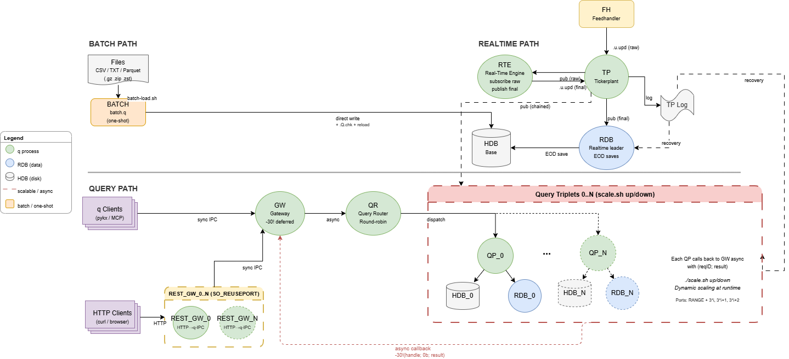

# Scalable Tick++ Reference Architecture

A template for a more scalable implementation of KDB-X tick architecture with realtime + batch ingest, async gateway, query routing, and dynamic scaling.  This is an extension of the [base Tick++ architecture](../tick/README.md).

## Architecture

The system is composed of **pluggable modules** that can be started independently or together:

| Module | Processes | Purpose |
| --- | --- | --- |
| **realtime** | TP, RDB, HDB, FH, RTE | Realtime data ingestion via kdb-tick, with inline enrichment |
| **query** | GW, QR, QP_N + RDB_N + HDB_N | Async read queries via deferred sync |
| **batch** | BATCH (one-shot) | Bulk file loading (CSV/TXT/parquet) directly into HDB |

Start any combination with the `-p` flag:

`./scripts/scalable-tick++/startup.sh -p realtime,query -m 2`



### Realtime Path (Tick)

Standard kdb-tick with feedhandler, tickerplant, and RDB (the realtime leader that handles end-of-day saves and HDB reloads). An RTE (Real-Time Engine) process sits alongside RDB to run enrichment analytics on incoming records and republish the derived rows back to TP.

```
Feedhandler → Tickerplant → RTE (enrich) → Tickerplant → RDB → HDB (EOD save)
                                                             → RDB_0..N  (chained read replicas)
```

**Enrichment file convention**: RTE is driven by an enrichment file (path supplied via `RTE_ENRICH_FILE` / the `-enrichFile` CLI arg). The file defines enrichment functions and registers them — and their TP subscriptions — using two helpers:

- `.rte.addSubscription[table;syms]` — subscribe RTE to `table` on TP for the given syms (use `` ` `` for all syms).
- `.rte.addEnrichment[func;table]` — register `func` as an enrichment function for `table`. RTE invokes it against incoming rows.

Enrichment functions publish derived rows back to TP via the `.rte.pub[table;data]` helper. Adding a new analytic is a script-only change — no edit to `rte.q` required. See [samples/enrichments/enrich-sample.q](samples/enrichments/enrich-sample.q) for a worked example (heat-index analytic on the `weather` table publishing to `weatherHeatIndex`).

### Query Path (Async)

Non-blocking query architecture using deferred sync responses (`-30!`). Both q-IPC clients and REST clients converge on the GW, which stays non-blocking internally via `-30!`. REST traffic is absorbed by N REST_GW processes sharing the HTTP port via Linux SO_REUSEPORT.

```
q Client (sync IPC) ─────────────────┐
                                     ↓
HTTP Client → REST_GW_0..N ───→ GW (-30! deferred) → QR (round-robin FIFO) → QP → RDB/HDB
              (SO_REUSEPORT)     ↑                                             │
                                 └──────────── async callback ─────────────────┘
```

**q-IPC flow:**

1. Client sends sync request to GW: `gwH (`.kxgw.query; `rdb; "select from energy")`
2. GW generates reqID, stores in REQUESTS table, dispatches to QR async, returns `-30!(::)` to suspend response
3. QR selects next alive QP via round-robin (or queues if all busy), forwards async
4. QP executes query synchronously against its paired RDB/HDB
5. QP sends async callback to GW with result
6. GW resumes suspended response via `-30!(clientHandle; 0b; result)`
7. Client receives result as the return value of their original sync call

**REST flow:**

REST adds a thin adapter in front. The HTTP request hits `$REST_PORT`; the Linux kernel routes it to one of the `REST_GW_COUNT` instances listening via `rp,$REST_PORT`. That REST_GW's endpoint handler calls `.restgw.query[target;query]` which is a **sync q-IPC call** to the main GW. The GW then runs the exact same flow as above — `-30!` defer, QR dispatch, QP execute, callback, resume. When `-30!` resumes the REST_GW's sync call, REST_GW returns the result as JSON over HTTP.

Single back-pressure model: REST and q-IPC clients share the same QR queue, `MAX_QUEUE_DEPTH`, `REQ_TIMEOUT`, and cancellation semantics. No REST-specific code on the GW.

### Batch Path (File Loader)

One-shot file loader for bulk historical data loads, backfills, and one-off ingestion. Writes directly to the HDB as date-partitioned splayed tables, bypassing the tick stack entirely.

```
File (CSV/TXT/Parquet) → batch-load.sh → batch.q → HDB (direct write)
                                                   → reload all HDBs
```

**Flow:**

1. `batch-load.sh` validates args, sources `.env`, decompresses if needed (`.gz`/`.zip`/`.zst`)
2. Launches `batch.q` which loads schemas and derives type strings from `meta TABLE`
3. Reads file — single pass if <10MB, chunked via `.Q.fsn` if >=10MB
4. Each chunk: applies column mapping (`-colMap`), injects `time`/`sym` if missing, reorders to match schema
5. Saves splayed via `.Q.en` + upsert (append mode) or clears partition first (overwrite mode)
6. Runs `.Q.chk` to fill missing tables across partitions
7. `batch-load.sh` triggers `reload-hdb.sh` so all running HDBs pick up the new data

### Process Inventory

| Process | Script | Role |
| --- | --- | --- |
| TP | `tick.q` | Tickerplant - central data hub, pub/sub, log replay |
| RDB | `r.q` | Realtime leader - tick subscription, EOD saves. Not in query path |
| RDB_N | `r.q` | Chained read replicas - one per QP, queried for real-time data |
| HDB | `hdb.q` | Base historical database - always started |
| HDB_N | `hdb.q` | Per-triplet historical databases - one per QP |
| FH | `fh.q` | Feedhandler - timer-based data ingestion |
| RTE | `rte.q` | Real-Time Engine - loads an enrichment file that registers TP subscriptions and enrichment functions, runs the analytics on incoming rows, republishes results to TP. Single instance |
| QR | `qr.q` | Query Router - worker registration, round-robin dispatch, FIFO queue |
| GW | `gw.q` | Gateway - q-IPC entry point, request tracking, deferred responses. Pure q-IPC (no HTTP) |
| QP_N | `qp.q` | Query Processors - execute queries, callback to GW |
| REST_GW_N | `rest-gw.q` | REST adapter - thin HTTP→q-IPC layer. N instances share `$REST_PORT` via Linux SO_REUSEPORT |
| BATCH | `batch.q` | Batch file loader - one-shot CSV/TXT/parquet into HDB |

### 1:1 Triplet Mapping

Each QP is paired with exactly one RDB and one HDB, isolating load per query worker. This is controlled by the `-m` flag:

```
-m 0:  TP, RDB, HDB, FH, QR, GW  (no query path)
-m 2:  + RDB_0, HDB_0, QP_0
        + RDB_1, HDB_1, QP_1
```

Ports are allocated from `PARALLEL_PORT_RANGE_START` in interleaved triplets for dynamic scaling:

```
Triplet i:
  RDB_i = PARALLEL_PORT_RANGE_START + 3*i
  HDB_i = PARALLEL_PORT_RANGE_START + 3*i + 1
  QP_i  = PARALLEL_PORT_RANGE_START + 3*i + 2
```

## Prerequisites

### KDB-X Modules

The following additional KDB-X modules are required to enable logging:

- [logging](https://github.com/KxSystems/logging)
- [printf](https://github.com/KxSystems/printf)

### System Dependencies

The shell scripts require the following standard Linux/Unix utilities:

| Command | Used by | Purpose |
| --- | --- | --- |
| `bash` | All scripts | Shell interpreter (cron requires explicit `SHELL=/bin/bash`) |
| `ps` | restart, scale, monitor | Process listing for liveness checks |
| `grep` | restart, scale, monitor | Pattern matching on process names |
| `awk` | restart, scale, monitor | Extract PIDs from `ps` output |
| `kill` | restart, scale, shutdown | Terminate processes |
| `sleep` | startup, restart, load-test | Brief pauses between process launches |
| `date` | monitor | Timestamps in watchdog output |
| `xargs` | restart, shutdown | Pipe PIDs to `kill` |
| `realpath` | startup | Resolve absolute paths |
| `basename` | startup | Extract filename from path |
| `tail` | reload-hdb | Extract last line of output |
| `find` | rotate-logs | Locate old log files for deletion |
| `rm` | rotate-logs | Delete old log files |
| `tee` | batch-load | Duplicate output to both console and log file |
| `q` | All scripts | KDB-X/kdb+ binary (`QLIC` and `PATH` must be set for cron) |
| `curl` | REST queries (optional) | Test REST endpoints on the GW |
| `pgrep` | Monitoring (optional) | Quick process lookup |
| `crontab` | Watchdog setup (optional) | Schedule `monitor.sh` |

## Config

Create a `.env` file within the repo with the following variables:

| Variable | Example Value | Description |
| --- | --- | --- |
| SCHEMA_DIR | /path/to/samples/schemas | Directory containing `.q` schema files |
| SAMPLE_DATA | /path/to/samples/data | Directory containing raw data for ingestion |
| TPLOG_DIR | /path/to/tplogs | Directory for tickerplant log files |
| TPLOG_NAME | sampleSchema | Prefix for TP log file name |
| HDB_DIR | /path/to/hdb | Directory for historical data on disk |
| PROCESS_LOG_DIR | /path/to/proclogs | Directory for process log files |
| TICK_PORT | 5010 | Tickerplant port |
| RDB_PORT | 5011 | RDB port (realtime leader) |
| HDB_PORT | 5012 | HDB port (always started) |
| GW_PORT | 5013 | Gateway port |
| FH_PORT | 5014 | Feedhandler port |
| QR_PORT | 5015 | Query Router port |
| RTE_PORT | 5016 | Real-Time Engine port |
| RTE_ENRICH_FILE | /path/to/samples/enrichments/enrich-sample.q | Enrichment script loaded by RTE — registers TP subscriptions and enrichment functions |
| REST_PORT | 5017 | Shared HTTP port for all REST_GW processes (SO_REUSEPORT) |
| REST_GW_COUNT | 1 | Number of REST_GW instances. Scales independently of query triplets. Optional, defaults to 1 |
| ANALYTIC_DIR | /path/to/samples/analytics | Directory for REST analytics loaded by REST_GW processes |
| PARALLEL_PORT_RANGE_START | 5040 | Starting port for query triplets (RDB/HDB/QP) |
| FH_TIMER | 60000 | Feedhandler timer interval (ms) |
| FH_ANALYTIC_DIR | /path/to/samples/data/fh-analytics | Feedhandler custom analytics directory |
| QUERY_TIMEOUT | 60 | Max query execution time (seconds) on RDB/HDB/QP. Optional, defaults to 60 |
| MAX_QUEUE_DEPTH | 100 | Max queued requests on QR before rejecting new ones. Optional, defaults to 100 |

Then create the required directories and ensure scripts are executable:

```bash
$ cp samples/sample_env .env && \
source .env && \
printenv | grep _DIR | grep x-starter | cut -d '=' -f 2 | xargs -I{} mkdir -p {}
```

## Usage

### Start

```bash
# Start with 2 query triplets and the default REST_GW count (1)
$ ./scripts/scalable-tick++/startup.sh -m 2
Starting processes on ports...
  Started TP          [5010]
  Started RDB         [5011]
  Started RDB_0       [5040]
  Started RDB_1       [5043]
  Started HDB         [5012]
  Started HDB_0       [5041]
  Started HDB_1       [5044]
  Started FH          [5014]
  Started RTE         [5016]
  Started QR          [5015]
  Started GW          [5013]
  Started QP_0        [5042] → RDB_0:5040 HDB_0:5041
  Started QP_1        [5045] → RDB_1:5043 HDB_1:5044
  Started REST_GW_0   [rp,5017] → GW:5013

# Start with 2 triplets + 4 REST_GWs
$ REST_GW_COUNT=4 ./scripts/scalable-tick++/startup.sh -m 2
```

<details>
<summary>Startup Flags</summary>

| Flag | Default | Description |
| --- | --- | --- |
| `-e` | `.env` | Path to env file |
| `-s` | `0` | Number of secondary threads per process |
| `-m` | `0` | Number of query triplets (RDB+HDB+QP). 0 = no query path |
| `-p` | `realtime,query` | Comma-separated modules to start. Options: `realtime`, `query` |

</details>

### Stop

```bash
$ ./scripts/scalable-tick++/shutdown.sh
```

### Restart Individual Processes

The `restart.sh` script kills and restarts specific processes without taking down the stack:

```bash
$ ./scripts/scalable-tick++/restart.sh GW                   # Restart gateway
$ ./scripts/scalable-tick++/restart.sh GW -r 0D00:00:05     # Restart GW with 5s request timeout
$ ./scripts/scalable-tick++/restart.sh QR                   # Restart query router
$ ./scripts/scalable-tick++/restart.sh QP -m 2              # Restart all QPs (need -m to calculate ports)
$ ./scripts/scalable-tick++/restart.sh QP_0 -m 2            # Restart a single QP
$ ./scripts/scalable-tick++/restart.sh RDB                  # Restart realtime leader
$ ./scripts/scalable-tick++/restart.sh RDB_1 -m 2           # Restart a specific chained RDB
$ ./scripts/scalable-tick++/restart.sh RDB_ALL -m 2         # Restart all chained RDBs
$ ./scripts/scalable-tick++/restart.sh HDB                  # Restart HDB
$ ./scripts/scalable-tick++/restart.sh HDB_ALL -m 2         # Restart all triplet HDBs
$ ./scripts/scalable-tick++/restart.sh REST_GW_0            # Restart a single REST_GW
$ ./scripts/scalable-tick++/restart.sh REST_GW              # Restart all REST_GWs
```

### Dynamic Scaling

The `scale.sh` script scales triplets and REST_GWs independently at runtime — no restart needed. New QPs self-register with the QR; new REST_GWs immediately start sharing the HTTP port via SO_REUSEPORT.

```bash
$ ./scripts/scalable-tick++/scale.sh status                  # Show triplet AND REST_GW counts

# Triplets (RDB + HDB + QP) — scale query concurrency
$ ./scripts/scalable-tick++/scale.sh up                      # Add 1 triplet
$ ./scripts/scalable-tick++/scale.sh up 3                    # Add 3 triplets
$ ./scripts/scalable-tick++/scale.sh down                    # Remove the last triplet
$ ./scripts/scalable-tick++/scale.sh down 2                  # Remove the last 2 triplets
$ ./scripts/scalable-tick++/scale.sh to 5                    # Scale to exactly 5 triplets

# REST_GWs — scale HTTP concurrency independently of triplets
$ ./scripts/scalable-tick++/scale.sh rest-up                 # Add 1 REST_GW
$ ./scripts/scalable-tick++/scale.sh rest-up 3               # Add 3 REST_GWs
$ ./scripts/scalable-tick++/scale.sh rest-down               # Remove the last REST_GW
$ ./scripts/scalable-tick++/scale.sh rest-to 8               # Scale to exactly 8 REST_GWs
```

**Scaling rationale:** triplets scale query concurrency (parallel DB reads); REST_GWs scale HTTP accept/serialize capacity. A heavy-query / thin-HTTP workload wants many triplets and few REST_GWs; a high-fan-in HTTP workload with fast queries wants the opposite.

### Watchdog (Process Monitoring)

The `monitor.sh` script checks if all expected processes are alive and restarts any that have died. It respects startup dependencies (e.g. QR before GW before QPs).

```bash
# Manual run for a 2-triplet setup
$ ./scripts/scalable-tick++/monitor.sh -m 2

[2026-04-16T17:40:01] [OK]   TP
[2026-04-16T17:40:01] [OK]   RDB
[2026-04-16T17:40:01] [OK]   HDB
[2026-04-16T17:40:01] [OK]   FH
[2026-04-16T17:40:01] [OK]   QR
[2026-04-16T17:40:01] [OK]   GW
[2026-04-16T17:40:01] [OK]   RDB_0
[2026-04-16T17:40:01] [OK]   HDB_0
[2026-04-16T17:40:01] [DEAD] QP_0 — restarting...
[2026-04-16T17:40:01]         Started QP_0 [5042]
[2026-04-16T17:40:01] [OK]   RDB_1
[2026-04-16T17:40:01] [OK]   HDB_1
[2026-04-16T17:40:01] [OK]   QP_1
[2026-04-16T17:40:01] Restarted 1 process(es).
```

For automated monitoring, set up a cron job. Note that cron requires explicit `SHELL`, `PATH`, and `QLIC` since it doesn't source your shell profile:

```bash
# Sample crontab entry (edit via `crontab -e`)
SHELL=/bin/bash
PATH=/path/to/kx/bin:/usr/local/bin:/usr/bin:/bin
QLIC=/path/to/kx/license/dir/
*/1 * * * * cd /path/to/x-starter && ./scripts/scalable-tick++/monitor.sh -m 1 >> /path/to/proclogs/monitor.log 2>&1
```

- `SHELL=/bin/bash` — cron defaults to `/bin/sh` which may not support bash syntax
- `PATH` — must include both the `q` binary directory and standard system tools (`ps`, `grep`, etc.)
- `QLIC` — directory containing your kdb+ license file (`kc.lic` or `k4.lic`)
- `*/1` — runs every minute. Adjust as needed
- Output appends to `monitor.log` for restart history

## Querying

### IPC (q Client)

Clients connect to the GW via sync IPC and call `.kxgw.query`:

```q
h:hopen `:localhost:5013

// Simple string query
h (`.kxgw.query; `rdb; "select from energy")

// Projection with args (sent to QP, executed on RDB)
h (`.kxgw.query; `rdb; ({[tab;t1;t2] select from tab where time within (t1;t2)}; `energy; 0D15:34:00; 0D15:35:00))

// HDB query
h (`.kxgw.query; `hdb; ({[tab;d] select from tab where date=d}; `weather; 2026.02.18))

// Both RDB + HDB in parallel (scatter-gather fan-out)
// Pass (rdbQuery; hdbQuery) — each can be different
// Returns `rdb`hdb!(rdbResult; hdbResult)
h (`.kxgw.query; `both; ("select from energy"; "select from energy where date=2026.04.16"))
```

The `target` parameter accepts `` `rdb``, `` `hdb``, or `` `both``:

- `` `rdb`` / `` `hdb`` — single query, executed on one data source
- `` `both`` — pass a two-element list `(rdbQuery; hdbQuery)`. Each query can be different (e.g. different `where` clauses). The QP executes both in parallel using async IPC and returns a dictionary keyed by source: `` `rdb`hdb!(rdbResult; hdbResult) ``. The client handles aggregation (e.g. `raze value res` if schemas match). If either source is unavailable or errors, the entire request fails — no partial results.

The query is dispatched async through the GW -> QR -> QP chain. The client blocks waiting for the result (sync from their perspective), but the GW stays non-blocking internally.

Alternatively, use the included client script to start an interactive q session pre-connected to the GW:

```bash
$ source .env && q kdb-x-platform/client.q -gwPort 5013 -procName client1
```

This opens a handle stored in `GW_H` which you can use directly:

```q
q) GW_H (`.kxgw.query; `rdb; "select from energy")
q) GW_H (`.kxgw.query; `hdb; ({[tab;d] select from tab where date=d}; `weather; 2026.02.18))
```

Note: `.env` must be sourced first so that `PROCESS_LOG_DIR` is set for the logging module.

### REST

REST traffic is handled by the **REST_GW** processes, not the main GW. N REST_GWs share `$REST_PORT` via Linux SO_REUSEPORT (`-p rp,$REST_PORT`); the kernel distributes HTTP connections across them for parallel accept/serialize.

Analytics loaded from `ANALYTIC_DIR` are registered as kx.rest endpoints on each REST_GW. Handlers build a parse-tree query and delegate to the main GW via sync q-IPC through `.restgw.query[target;query]`. From the GW's perspective a REST_GW is just another q-IPC client — the query goes through the same `-30!` deferred path, the same QR queue, the same timeout/cancellation machinery. No REST-specific code lives on the GW.

#### REST dispatch path

```
HTTP client → REST_GW_i (one of N, chosen by kernel via SO_REUSEPORT)
           → .restgw.query[target;query] sync-IPC → GW (.kxgw.query)
           → GW -30! defer → QR dispatch → QP → RDB/HDB → callback → GW resume
           → REST_GW's sync call unblocks → JSON → HTTP response
```

| Property | Behaviour |
| --- | --- |
| **Port sharing** | All REST_GWs listen on the same `$REST_PORT` via `rp,$REST_PORT`. Linux's SO_REUSEPORT round-robins TCP connections across them. Scaling REST_GWs adds HTTP accept capacity without any LB config. |
| **Unified queue** | REST requests hit the same QR FIFO queue as q-IPC clients. `MAX_QUEUE_DEPTH` and `MAX_PER_WORKER` apply uniformly. No separate REST pool. |
| **Timeouts** | `REQ_TIMEOUT` on the GW covers both. If the deferred sync on GW times out, the REST_GW's sync call receives the error dict which it converts to HTTP 500. |
| **Error semantics** | kx.rest surfaces all errors as HTTP 500 with `details` containing the underlying message. `QUERY:` prefix indicates a query failure, other errors are passed through from the GW. |

#### REST API Reference (sample: energy / weather)

The sample analytics in `samples/analytics/` expose typed per-table endpoints for `energy` and `weather`, plus two generic parametric endpoints (`/rdb`, `/hdb`) that take the table name as a query param. All hit `$REST_PORT` (default 5017).

<details>
<summary>/energy/rdb — realtime energy query</summary>

| Parameter | Required | Type | Default | Description |
| --- | --- | --- | --- | --- |
| t1 | No | Timespan | 0D00:00:00 | Lower time bound |
| t2 | No | Timespan | 0D23:59:59 | Upper time bound |
| s | No | Symbol | ` | Blower sym to filter (e.g. `BLOWER78_1`) |

```bash
$ curl "localhost:5017/energy/rdb?t1=0D15:34&t2=0D15:35&s=BLOWER78_1"
```

</details>

<details>
<summary>/weather/hdb — historical weather query</summary>

| Parameter | Required | Type | Default | Description |
| --- | --- | --- | --- | --- |
| d | Yes | Date | .z.d-1 | Partition date |
| t1 | No | Timespan | 0D00:00:00 | Lower time bound |
| t2 | No | Timespan | 0D23:59:59 | Upper time bound |
| s | No | Symbol | ` | Location sym to filter (e.g. `` `$"San Diego" ``) |

```bash
$ curl "localhost:5017/weather/hdb?d=2026.04.17&s=San%20Diego"
```

</details>

The same shape applies to `/energy/hdb`, `/weather/rdb`, `/energy/meta`, `/weather/meta`. Two generic endpoints are also registered: `/rdb?tab=<table>&...` and `/hdb?tab=<table>&d=<date>&...` — these delegate through the same `.restgw.query` → main GW → QR/QP path but let the caller pick any loaded table. See `samples/analytics/*.q` for definitions.

#### Adding Endpoints

Custom analytics are added by creating `.q` scripts in `$ANALYTIC_DIR`. They're loaded by every REST_GW on startup. Registration uses [.rest.register](https://code.kx.com/kdb-x/modules/rest-server/reference.html#restregister) applied to the contents of the `.endpoints` namespace.

Handlers should build a parse-tree query and delegate via `.restgw.query[target;query]`:

```q
myRdbHandler:{[t1;t2;s]
    w:enlist (within;`time;(t1;t2));
    if[not null s; w:w,enlist (=;`sym;enlist s)];
    .restgw.query[`rdb; (?;`mytable;w;0b;())]
 };
```

Therefore to expose a new endpoint, simply add a new variable to the namespace which follows the formatting of the `.endpoints` namespace.

<details>
<summary>.endpoints Namespace Format</summary>

```q
.endpoints.newEndpoint:(!). flip (
    (`request; `get);
    (`endpoint; "/endpointPath");
    (`description; "Description of endpoint");
    (`qFunc; qHandlerFunction);
    (
        `params;
        .rest.reg.data[`paramName1;paramType;requiredFlag;defaultVal;"description"],
        ... ,
        .rest.reg.data[`paramNameN;paramType;requiredFlag;defaultVal;"description"]
    )
 );
```

where `qHandlerFunction` is the q function to run on the given input parameters:

```q
qHandlerFunction:{[paramName1;...;paramNameN]
    q query logic
};
```

</details>

## Queuing and Backpressure

The QR maintains a FIFO queue for requests when all QP workers are busy. Each QP handles one request at a time (`MAX_PER_WORKER:1`); additional requests queue on the QR rather than piling up in TCP buffers.

When a QP completes a request, it notifies the QR which dequeues the next request and dispatches it to the now-free worker.

If the queue reaches `MAX_QUEUE_DEPTH` (default 100, override via env var), new requests are rejected immediately with a "Server busy, queue full" error. This prevents unbounded memory growth under sustained load.

Timed-out and cancelled requests are also removed from the queue — the GW notifies the QR to dequeue them so they don't waste a QP slot.

### Error contract

All control-plane errors (backpressure, timeouts, cancellation, unavailability) flow back to the caller as a `` `error`msg!(reason;detail) `` dict. The REST_GW remaps `reason` to a tag prefix so HTTP clients can disambiguate failure modes from the 500 body's `details` field:

| Reason (q-IPC `res[`error]`) | REST tag (HTTP 500 `details` prefix) | When |
| --- | --- | --- |
| `"Server busy, queue full"` | `BUSY: …` | QR queue at `MAX_QUEUE_DEPTH` — retryable |
| `"Request timed out"` | `TIMEOUT: …` | GW `REQ_TIMEOUT` tripped before QP callback |
| `"Request cancelled"` | `CANCEL: …` | Caller invoked `.kxgw.cancel[reqID]` on another handle |
| `"No available QP workers"` | `UNAVAIL: …` | QR has no alive QPs (all crashed / none registered) |
| `"QR not connected"` | `UNAVAIL: …` | GW lost its handle to QR |
| Anything else (e.g. query execution failure) | `QUERY: …` | Per-request error from QP/RDB/HDB |

**q-IPC callers** receive the dict directly:

```q
res:h (`.kxgw.query; `rdb; "select from trade");
$[99h=type res; if[`error in key res; -1 "failed: ",res`error]; …]
```

**REST callers** get `HTTP 500` with a JSON body like:

```json
{"code":"500","text":"internal_error","details":"BUSY: Server busy, queue full"}
```

No automated test covers BUSY — it requires saturating a real queue and is race-sensitive. Exercise manually by setting `MAX_QUEUE_DEPTH=1` + `-m 1`, then firing three concurrent slow queries (`{system "sleep 2"; select from trade}`); the third should come back BUSY-tagged on both paths.

### Request Cancellation

Clients can cancel an inflight request:

```q
// From another handle (not the one waiting for the response)
gwH (`.kxgw.cancel; reqID)
```

The client waiting on the original request receives `'Request cancelled` immediately. If the QP was already executing the query, it finishes but the result is discarded.

## Timeouts

There are two layers of timeout protection:

### Query Timeout (`-T`)

The kdb+ `-T` flag is set on RDB, HDB, and QP processes (default 60s, override via `QUERY_TIMEOUT` in `.env`). Any sync query exceeding this limit is killed with `'stop`. The QP catches this via protected eval and returns an error to the client.

### Request Timeout (GW)

The GW runs a timer that scans for inflight requests older than `REQ_TIMEOUT` (configurable via `-reqTimeout` CLI arg, default 60s). Stale requests are cleaned up and the client receives a `'Request timed out` error.

This catches cases where a QP dies mid-query and never calls back.

## Reconnection

### Initial connection retries

All processes that open IPC handles at startup retry with **exponential backoff + jitter** if the target is unavailable. This handles TCP backlog exhaustion when many processes start simultaneously (e.g. during `startup.sh -m 8` or burst restarts via `monitor.sh`).

- Backoff: 100ms, 200ms, 400ms, 800ms... doubling each attempt
- Jitter: random 0-100ms added to each delay (desynchronises retries across processes)
- Max 10 attempts before fatal exit

Covered processes:

| Process | Retries on | Falls back to |
| --- | --- | --- |
| RDB | TP | Loads schemas from files (empty tables) if TP never comes up |
| FH | TP | Exits fatally after retries exhausted |
| GW | QR | Exits fatally after retries exhausted |
| QP | RDB, HDB, QR, GW (all) | Exits fatally on first failure |

### Runtime reconnection

Once running, all processes re-establish lost handles via timer functions:

- **GW**: reconnects to QR if handle drops; fails all inflight requests immediately when QR dies (clients don't wait for timeout)
- **QP**: reconnects to QR (and re-registers), GW, and dead DB connections
- **QR**: dead QPs are marked inactive via `.z.pc`; QPs re-register automatically when they reconnect
- **RDB**: reconnects to TP if handle drops
- **RTE**: reconnects to TP if handle drops; re-subscribes to all tables registered in `.rte.subscriptions` on reconnect

## Failover

RDB is the realtime leader. If it fails, the tickerplant promotes the first available chained RDB to leader via `.u.failoverRDB`. Leadership status is tracked in `.u.RDB_CONNECTIONS` on the tickerplant.

If a QP dies, the QR marks it dead and stops routing to it. Remaining QPs handle traffic. When a replacement QP starts, it self-registers with the QR automatically.

## Testing

The `tests/` directory contains:

| File | Purpose |
| --- | --- |
| `tests/client.q` | Single-shot test client used by `load-test.sh` |
| `tests/load-test.sh` | Concurrent client load test (spawns N q processes) |
| `tests/api-test.q` | Validates `.api.query` validation and dispatch end-to-end |
| `tests/rest-test.q` | Validates REST endpoints (meta / rdb / hdb / BUSY / concurrency) |

Quick examples:

```bash
# 50 concurrent clients hitting RDB
$ ./tests/load-test.sh -n 50 -p 5013 -t rdb -q "select from energy"

# Run the API layer validation suite (q-IPC)
$ source .env && q tests/api-test.q -gwPort $GW_PORT -procName api-test

# Run the REST endpoint suite against the REST_GWs
$ source .env && q tests/rest-test.q -gwPort $REST_PORT -procName rest-test
```

## Data Ingestion

Within the feedhandler, custom parsers are loaded dynamically from the `fh-analytics` directory and executed via the `.fh.upsert` namespace.

<details>
<summary>Example .fh.upsert Function</summary>

```q
.fh.upsert.funcName:{[]
    neg[TP]("u.upd"; tabName; records);
}
```

</details>

The timer interval can be controlled at runtime using the `scripts/scalable-tick++/fh-timer.sh` script:

```bash
$ source scripts/scalable-tick++/fh-timer.sh
$ start_fh_timer    # resume ingestion
$ stop_fh_timer     # pause ingestion (FH stays connected to TP)
```

### Batch Loading

The `batch-load.sh` script loads files directly into the HDB without going through the tick stack. Supports CSV, TXT, parquet, and compressed files (`.gz`, `.zip`, `.zst`).

```bash
# Load a CSV into the energy table for a specific date
$ ./scripts/scalable-tick++/batch-load.sh -f KwhConsumptionBlower78_1.csv -t energy -d 2026.04.17 -s BLOWER78_1 \
    -C "TxnDate:date,TxnTime:timeWindow,Consumption:consumption"

# Load a weather CSV with column remapping
$ ./scripts/scalable-tick++/batch-load.sh -f weather_data.csv -t weather -d 2026.04.17 \
    -C "Location:sym,Date_Time:dateTime,Temperature_C:temp,Humidity_pct:humidity,Precipitation_mm:precipitation,Wind_Speed_kmh:windSpeed"

# Load a compressed file (decompressed automatically)
$ ./scripts/scalable-tick++/batch-load.sh -f weather_data.csv.gz -t weather -d 2026.04.17

# Overwrite an existing partition instead of appending
$ ./scripts/scalable-tick++/batch-load.sh -f KwhConsumptionBlower78_1.csv -t energy -d 2026.04.17 -m overwrite
```

<details>
<summary>batch-load.sh Flags</summary>

| Flag | Required | Default | Description |
| --- | --- | --- | --- |
| `-f` | Yes | — | Path to data file (CSV, TXT, parquet). Supports `.gz`/`.zip`/`.zst` |
| `-t` | Yes | — | Target table name (must match a schema in `SCHEMA_DIR`) |
| `-d` | Yes | — | Partition date (`YYYY.MM.DD`) |
| `-D` | No | `,` | Delimiter character for text files |
| `-s` | No | — | Default `sym` value if not present in source data |
| `-C` | No | — | Column rename mapping: `"SrcCol:tgtCol,SrcCol2:tgtCol2"` |
| `-e` | No | `.env` | Path to env file |
| `-m` | No | `append` | Write mode: `append` or `overwrite` |

</details>

Files >=10MB are automatically read in chunks to limit memory usage. After a successful load, all running HDB processes are reloaded to pick up the new data.

### Sample Data (energy / weather)

The bundled sample data covers two generic domains:

- **energy** — three CSVs under `samples/data/structured/KwhConsumptionBlower78_*.csv`: Kwh readings per blower (`sym` = blower id, e.g. `BLOWER78_1`).
- **weather** — `samples/data/structured/weather_data.csv`: temperature / humidity / precipitation / wind for a set of locations (`sym` = location name).

Realtime ingest is driven by the FH via `.fh.parse.energy` / `.fh.parse.weather` in `samples/data/fh-analytics/parse-structured-data.q` (loaded automatically by FH). Historical backfill is orchestrated by `scripts/scalable-tick++/backfill.sh` which wraps `batch-load.sh` with the right column maps and partition dates for each CSV:

```bash
$ source .env
$ ./scripts/scalable-tick++/backfill.sh
```

After backfill, all running HDBs are reloaded automatically and `/energy/hdb` / `/weather/hdb` become queryable. The schemas are defined in `samples/schemas/sampleSchemas.q`.

## HDB Reload

The `reload-hdb.sh` script triggers a reload on all running HDB processes to pick up data changes made outside of the normal tick EOD path (e.g. manual data loads, external ingestion).

```bash
$ ./scripts/scalable-tick++/reload-hdb.sh
Reloading HDB processes...
  [OK]   HDB [5012]
  [OK]   HDB_0 [5041]
  [OK]   HDB_1 [5044]
Done.
```

Each HDB exposes a `.hdb.reload` function that can also be called directly via IPC:

```q
// From any q client
HDB_H (`.hdb.reload;`)
```

## Logging

### Usage

Logging is enabled on scripts by loading the `utils/logging.q` script. This script initialises the logging module and contains additional custom logging logic.

Default usage documentation can be found at https://github.com/KxSystems/logging/blob/main/docs/reference.md

<details>
<summary>Custom API Reference</summary>

#### .log.procStarted

Used to show the q command that was run to start the current process, prepending the input string to the log line.

```q
q) .log.procStarted["Tickerplant"];

2026.02.26D11:35:29.519047911 info PID[<pid>] HOST[<hostname>] Tickerplant started using command:     q kdb-x-platform/tick.q -p 5010 -schemaDir /path/to/schemas -tplogDir /path/to/tplogs -procName TP
```

#### .log.rollover

Used to roll the current processes log file to a new date.

```q
q) .log.rollover["TP";.z.d+1];
```

</details>

### Default Behaviour

By default the logging module will act in the following manner:

- Process logs saved to the path defined by `PROCESS_LOG_DIR` in the `.env` file.
- Log file names are in the format of `<procName>_<date>T<time>.log` where `procName` corresponds to the `-procName` flag value used in `scripts/scalable-tick++/startup.sh`.
- A `startup.log` file is created to log events ran by `scripts/scalable-tick++/startup.sh`.
- Logs use the `basic` format.
- All log levels are redirected to the process log files (trace, debug, info, warn, error, fatal).
- Default minimum level is `info` — `debug`/`trace` calls are silently dropped unless the level is lowered (see below).
- If `PROCESS_LOG_DIR` is not set, the process will exit with an error prompting you to source `.env`.

### Log level

kx.log gates calls to `.log.debug` / `.log.trace` behind a per-process level setting. [utils/main.q](utils/main.q) reads the level at startup and calls `.log.setlvl` on behalf of every process. Override the default (`info`) via either:

| Mechanism | Example | Scope |
| --- | --- | --- |
| Env var `LOG_LEVEL` in `.env` | `export LOG_LEVEL=debug` | All processes launched from that shell |
| CLI arg `-logLevel` | `q kdb-x-platform/rte.q ... -logLevel debug ...` | One process (takes precedence over env) |

Accepted values: `trace`, `debug`, `info`, `warn`, `error`, `fatal`. Anything else logs a `warn` on startup and the level stays at `info`. When the effective level is not `info`, the process logs `Log level set to [<level>]` as its first info line.

Useful `[FLOW ...]` debug traces are emitted by TP, RTE, FH, and RDB when running at `debug` — they show each hop of a publish (`upd received` / `pub -> TP` / etc.) so you can follow a batch through the tick stack.

<details>
<summary>Example Process Log Directory</summary>

```bash
$ ll /path/to/data/directory/proclogs
total 28
drwxr-xr-x 2 user user 4096 Feb 26 18:36 ./
drwxr-xr-x 6 user user 4096 Feb 18 15:42 ../
-rw-r--r-- 1 user user  475 Feb 26 18:36 GW_20260226T183617776.log
-rw-r--r-- 1 user user  262 Feb 26 18:36 HDB_20260226T183617776.log
-rw-r--r-- 1 user user  268 Feb 26 18:36 RDB_20260226T183618778.log
-rw-r--r-- 1 user user  519 Feb 26 18:36 TP_20260226T183617776.log
-rw-r--r-- 1 user user  862 Feb 26 18:36 startup.log
```

</details>

### Log Rotation

The `scripts/scalable-tick++/rotate-logs.sh` script deletes old process log and tickerplant log files to prevent unbounded disk usage. It reads `PROCESS_LOG_DIR` and `TPLOG_DIR` from the `.env` file and accepts optional flags to control retention period.

```bash
# Delete proclogs and tplogs older than 7 days (default)
$ ./scripts/scalable-tick++/rotate-logs.sh

# Use a custom .env file path
$ ./scripts/scalable-tick++/rotate-logs.sh -e /path/to/.env

# Keep only 3 days of proclogs, 14 days of tplogs
$ ./scripts/scalable-tick++/rotate-logs.sh --keep-days 3 --tp-keep-days 14
Deleted 12 proclog file(s) older than 3 days
Deleted 2 tplog file(s) older than 14 days
```

The script preserves `startup.log` regardless of age.

## Timers

The `.timer.funcs` dictionary pattern (defined in `utils/timer.q`) allows multiple timer functions per process. Add a function to the dictionary and it will be called on each `.z.ts` tick:

```q
.timer.funcs[`myFunc]:{[]
    // runs every timer tick
};
```

Timer interval is controlled per-process via `system"t <ms>"`.

### Built-in timer functions

- **`gwTimeout`** (GW): scans `REQUESTS` for stale inflight entries, sends `'Request timed out` to clients, notifies QR to dequeue
- **`gwReconnect`** (GW): re-establishes `QR_H` if dropped
- **`qpReconnect`** (QP): re-establishes QR, GW, and DB connections
- **`qrInflightReset`** (QR): safety reset of stale `inflight` counts when queue is empty
- **`rdbReconnectTP`** (RDB): re-establishes TP subscription if dropped
- **`rteReconnectTP`** (RTE): re-establishes TP subscription if dropped
- **`gc`** (GW, QR, QP): calls `.Q.gc[]` to return memory to heap on each tick, preventing unbounded RSS growth on long-running query-path processes
- **`loggingRoller`** (all): rolls the process log file when the date changes

## Monitoring

When running, the processes can be identified by the `-procName` flag. For example with `-m 2`:

```bash
$ pgrep -af procName

12345 q kdb-x-platform/tick.q -p 5010 ... -procName TP
12346 q kdb-x-platform/r.q -p 5011 -T 60 ... -procName RDB
12347 q kdb-x-platform/r.q -p 5040 -T 60 ... -procName RDB_0
12348 q kdb-x-platform/r.q -p 5043 -T 60 ... -procName RDB_1
12349 q kdb-x-platform/hdb.q -p 5012 -T 60 ... -procName HDB
12350 q kdb-x-platform/hdb.q -p 5041 -T 60 ... -procName HDB_0
12351 q kdb-x-platform/hdb.q -p 5044 -T 60 ... -procName HDB_1
12352 q kdb-x-platform/fh.q -p 5014 ... -procName FH
12353 q kdb-x-platform/qr.q -p 5015 ... -procName QR
12354 q kdb-x-platform/gw.q -p 5013 ... -procName GW
12355 q kdb-x-platform/qp.q -p 5042 -T 60 ... -procName QP_0
12356 q kdb-x-platform/qp.q -p 5045 -T 60 ... -procName QP_1
12357 q kdb-x-platform/rest-gw.q -p rp,5017 ... -procName REST_GW_0
```

Key tables to inspect on running processes:

| Process | Table / Variable | What it shows |
| --- | --- | --- |
| QR | `WORKERS` | Registered QPs, alive status, inflight counts |
| GW | `REQUESTS` | Inflight requests (should be empty when idle) |
| GW | `QR_H` | Handle to QR (null if disconnected) |
| QP | `DB_CONNECTIONS` | Connections to paired RDB/HDB |
| TP | `.u.RDB_CONNECTIONS` | RDB leader/follower status |

## Possible Enhancements

The following are beyond the scope of this reference architecture but may be relevant for production deployments:

- **Multi-GW / Multi-QR** — run multiple gateways and/or query routers for high availability. Clients would round-robin or load-balance across GWs. QPs would register with multiple QRs. Requires shared or replicated request state.
- **Queue persistence** — persist the QR queue to disk so queued requests survive a QR restart. Adds serialization, replay-on-startup, and stale entry handling.
- **Priority queuing** — replace FIFO with priority-based dispatch (e.g. by client, query type, or explicit priority flag). Useful when some queries are time-sensitive and others are batch/background.
- **Query deduplication / caching** — detect duplicate queries and return cached results. Particularly valuable for reference data queries that many clients request identically.
- **Metrics and observability** — expose `.kxgw.stats` / `.qr.stats` functions or tables with request counts, average latency, queue depth, worker utilisation. Could feed into Grafana or similar.
- **Authentication / permissioning** — restrict which clients can query which tables or targets. Could be implemented at the GW level via `.z.pw` or a custom auth layer.
- **Graceful shutdown** — drain inflight requests before killing a process. GW stops accepting new requests, waits for callbacks, then exits cleanly.
- **Fan-out queries** — split a single client request across multiple QPs (e.g. date-range queries across HDB partitions) and aggregate results on the GW or a dedicated aggregation process.
- **Dedicated REST gateway** — kdb is single-threaded per process and the REST path is synchronous (kdb's `-30!` doesn't support HTTP handles), so each GW serves one REST call at a time while blocking in `h query` against the pool. For a reference arch this is fine; under sustained REST load (public dashboards, high-fanout clients) the right scale-out is a **separate GW_REST process** running the same `gw.q` on its own port. It connects to the same QR, maintains its own `.gw.restPool` to the triplet workers, and participates in the same `WORKERS.inflight` back-pressure counter — so multiple REST GWs can run behind a load balancer without losing "server busy" semantics. `tests/rest-test.q` includes a concurrent-call probe showing current serialisation behaviour so the regression is visible when it starts mattering.

## Script Reference

### Shell Scripts

| Script | Description |
| --- | --- |
| `scripts/scalable-tick++/startup.sh` | Start the full stack. Use `-m N` for query triplets, `-s N` for secondary threads, `-e` for env file |
| `scripts/scalable-tick++/shutdown.sh` | Kill all running processes |
| `scripts/scalable-tick++/restart.sh` | Restart individual processes (e.g. `./scripts/scalable-tick++/restart.sh GW`, `./scripts/scalable-tick++/restart.sh QP_0 -m 2`) |
| `scripts/scalable-tick++/scale.sh` | Dynamically add/remove query triplets at runtime (e.g. `./scripts/scalable-tick++/scale.sh up`, `./scripts/scalable-tick++/scale.sh to 5`) |
| `scripts/scalable-tick++/monitor.sh` | Watchdog — checks all processes are alive, restarts dead ones. Run via cron |
| `scripts/scalable-tick++/reload-hdb.sh` | Trigger a reload on all running HDB processes to pick up data changes |
| `scripts/scalable-tick++/fh-timer.sh` | Source to expose `start_fh_timer` / `stop_fh_timer` for runtime FH control |
| `scripts/scalable-tick++/rotate-logs.sh` | Delete old process logs and TP logs based on retention period |
| `scripts/scalable-tick++/batch-load.sh` | Load a file (CSV/TXT/parquet) into HDB as a date-partitioned splayed table |
| `scripts/scalable-tick++/backfill.sh` | Bulk-load the bundled energy / weather CSVs into HDB across date partitions |
| `tests/load-test.sh` | Simulate N concurrent clients sending queries to the GW |

### q Scripts

| Script | Process | Description |
| --- | --- | --- |
| `kdb-x-platform/tick.q` | TP | Tickerplant — pub/sub, log replay, EOD coordination |
| `kdb-x-platform/u.q` | TP | Tick subscription/publishing utilities (loaded by tick.q) |
| `kdb-x-platform/r.q` | RDB, RDB_N | RDB — tick subscription, EOD save (realtime leader only), leader/follower |
| `kdb-x-platform/hdb.q` | HDB, HDB_N | HDB — loads partitioned data, exposes `.hdb.reload` |
| `kdb-x-platform/fh.q` | FH | Feedhandler — timer-based data ingestion |
| `kdb-x-platform/rte.q` | RTE | Real-Time Engine — loads an enrichment file that registers TP subscriptions and analytics, runs them on incoming rows, republishes to TP |
| `kdb-x-platform/gw.q` | GW | Gateway — q-IPC entry, request tracking, `-30!` deferred sync, timeouts, cancellation. Pure q-IPC (no HTTP) |
| `kdb-x-platform/qr.q` | QR | Query Router — worker registration, round-robin dispatch, FIFO queue |
| `kdb-x-platform/qp.q` | QP_N | Query Processor — executes queries against paired RDB/HDB, callbacks to GW |
| `kdb-x-platform/rest-gw.q` | REST_GW_N | REST adapter — HTTP server (kx.rest) that delegates to GW via sync q-IPC. N instances share `$REST_PORT` via SO_REUSEPORT |
| `kdb-x-platform/batch.q` | BATCH | Batch file loader — schema-aware CSV/TXT/parquet into HDB |
| `kdb-x-platform/client.q` | — | Interactive client with handles to GW, QR, TP, RDB, HDB |
| `tests/client.q` | — | Single-shot test client for load testing |
| `utils/main.q` | — | Shared init: CLI arg parsing, timer setup, logging init |
| `utils/logging.q` | — | kx.log wrapper with file logging and date rollover |
| `utils/timer.q` | — | `.timer.funcs` dictionary pattern for multi-function timers |
| `utils/reload-hdb-helper.q` | — | Helper for reload-hdb.sh — sends `.hdb.reload` via IPC |

## Appendix

### Directory Trees

<details>
<summary>Repo Directory Tree</summary>

```
kdbx-tick-reference-architecture/
├── app/
│   ├── hdb/
│   ├── proclogs/
│   └── tplogs/
├── samples/
│   ├── analytics/
│   ├── data/
│   ├── enrichments/
│   ├── schemas/
│   └── sample_env
├── scalable-tick++/
│   ├── README.md
│   ├── batch.q
│   ├── client.q
│   ├── fh.q
│   ├── gw.q
│   ├── hdb.q
│   ├── qp.q
│   ├── qr.q
│   ├── r.q
│   ├── rest-gw.q
│   ├── rte.q
│   ├── tick.q
│   └── u.q
├── scripts/
│   ├── scalable-tick++/
│   │   ├── backfill.sh
│   │   ├── batch-load.sh
│   │   ├── fh-timer.sh
│   │   ├── monitor.sh
│   │   ├── reload-hdb.sh
│   │   ├── restart.sh
│   │   ├── rotate-logs.sh
│   │   ├── scale.sh
│   │   ├── shutdown.sh
│   │   └── startup.sh
│   └── tick/
│       ├── fh-timer.sh
│       ├── monitor.sh
│       ├── restart.sh
│       ├── shutdown.sh
│       └── startup.sh
├── tests/
│   ├── scalable-tick++/
│   │   ├── api-test.q
│   │   ├── client.q
│   │   ├── load-test.sh
│   │   └── rest-test.q
│   └── tick/
│       ├── api-test.q
│       ├── e2e-test.q
│       └── rest-test.q
├── tick/
│   ├── README.md
│   ├── client.q
│   ├── fh.q
│   ├── gw.q
│   ├── hdb.q
│   ├── r.q
│   ├── rte.q
│   ├── tick.q
│   └── u.q
└── utils/
    ├── scalable-tick++/
    │   ├── logging.q
    │   ├── main.q
    │   ├── reload-hdb-helper.q
    │   ├── rotate-logs.sh
    │   └── timer.q
    └── tick/
        ├── logging.q
        ├── main.q
        ├── rotate-logs.sh
        └── timer.q
```

</details>

<details>
<summary>Initial Directory Tree</summary>

```bash
$ tree /path/to/data/directory/
.
├── hdb
├── proclogs
├── schemas
│   ├── sample-schema-file.q
│   └── second-schema-file.q
└── tplogs

5 directories, 2 files
```

</details>

<details>
<summary>Directory Tree Containing Data</summary>

```bash
$ tree /path/to/data/directory/
.
├── hdb
│   ├── 2026.02.18
│   │   ├── energy
│   │   │   ├── consumption
│   │   │   ├── date
│   │   │   ├── sym
│   │   │   ├── time
│   │   │   └── timeWindow
│   │   └── weather
│   │       ├── dateTime
│   │       ├── humidity
│   │       ├── precipitation
│   │       ├── sym
│   │       ├── temp
│   │       ├── time
│   │       └── windSpeed
│   └── sym
├── proclogs
│   ├── hdb
│   ├── rdb
│   └── tp
├── schemas
│   ├── sample-schema-file.q
│   └── second-schema-file.q
└── tplogs
    ├── testSchemaName2026.02.18
    └── testSchemaName2026.02.19

9 directories, 25 files
```

</details>

### Schema Files

Note that schemas must be created with the first two columns being `time` and `sym`.

<details>
<summary>Example contents of table schemas spread across multiple files</summary>

```bash
$ cat schemas/sample-schema-file.q

energy:([] time:`timespan$(); sym:`symbol$(); date:`date$(); timeWindow:`time$(); consumption:`float$())
weather:([] time:`timespan$(); sym:`symbol$(); dateTime:`datetime$(); temp:`float$(); humidity:`float$(); precipitation:`float$(); windSpeed:`float$())

$ cat schemas/second-schema-file.q

genericTab:([] time:`timespan$(); sym:`symbol$(); c1:(); c2:())
```

</details>

### Sample Data

The sample data used is a mixture of CSV and PDF files. Custom parsers normalise the sample data to match the TP schema.

<details>
<summary>Sample Data Directory Tree</summary>

```bash
$ tree /path/to/samples/data/directory/
.
├── fh-analytics/
│   └── custom-parse-file.q
├── structured/
│   └── *.csv
└── unstructured/
    └── *.pdf

3 directories, 3 files
```

</details>

<details>
<summary>Sample Files Reference</summary>

The sample files used were sourced from the following locations:

**Structured**

- https://www.kaggle.com/datasets/vitthalmadane/energy-consumption-time-series-dataset/data?select=KwhConsumptionBlower78_1.csv
- https://www.kaggle.com/datasets/prasad22/weather-data

**Unstructured**

- https://www.gov.uk/government/statistics/energy-chapter-1-digest-of-united-kingdom-energy-statistics-dukes

</details>
