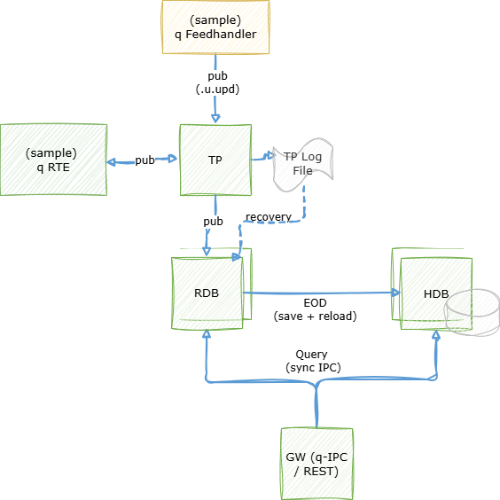

# Tick++ Reference Architecture

A template for KDB-X tick architecture with additional layers to exend base tick configuration.

## Description

The architecture contained within this repository consists of the following q processes:

- **Tickerplant (TP)** — receives updates from the feedhandler and distributes them to all subscribers
- **Feedhandler (FH)** — parses structured sample data and publishes to the tickerplant on a timer
- **Realtime Database (RDB)** — subscribes to the tickerplant and holds today's data in memory; saves to HDB at end of day
- **Historical Database (HDB)** — stores partitioned on-disk data, reloaded after each end-of-day save
- **Real-Time Engine (RTE)** — subscribes to the tickerplant, runs enrichment functions, and publishes derived tables back to the tickerplant
- **Gateway (GW)** — routes queries to the RDB and/or HDB and serves REST endpoints for the analytics defined in `ANALYTIC_DIR`

In the documentation below it explains where to take schemas, sample data, and analytics from and how to change them. It also explains how to customise the architecture based on your use case, for example how to deploy more than one RDB/HDB.

### Architecture Diagram



## Usage

### Prerequisites

The following KDB-X modules are required for full deployment of the system as they are integrated throughout the code - however, these are supplementary and are not prerequisites to the architecture itself:

- [logging](https://github.com/KxSystems/logging)
- [printf](https://github.com/KxSystems/printf)
- [kx.rest](https://code.kx.com/kdb-x/modules/rest-server/overview.html)

### Configuration

The following configuration steps are required before being able to run the tick processes:

- Create a `.env` file within the repo with the following variables defined. An example can be found under `samples/sample_env`.

  | Variable                  | Example Value                                     | Description                                                                                                              |
  | ------------------------- | ------------------------------------------------- | ------------------------------------------------------------------------------------------------------------------------ |
  | SCHEMA_DIR                | /path/to/repo/samples/schemas                     | Directory containing one or more `.q` files with table schemas used by the system.                                       |
  | SAMPLE_DATA               | /path/to/repo/samples/data                        | Directory containing the raw data files ingested by the feedhandler.                                                     |
  | TPLOG_DIR                 | /path/to/repo/app/tplogs                          | Directory to store tickerplant log files.                                                                                |
  | TPLOG_NAME                | tpLog                                             | Prefix for the tickerplant log file name.                                                                                |
  | HDB_DIR                   | /path/to/repo/app/hdb                             | Directory to store on-disk partitioned HDB data.                                                                         |
  | PROCESS_LOG_DIR           | /path/to/repo/app/proclogs                        | Directory to store per-process log files.                                                                                |
  | TICK_PORT                 | 5010                                              | Port for the tickerplant process.                                                                                        |
  | RDB_PORT                  | 5011                                              | Port for the realtime database process.                                                                                  |
  | HDB_PORT                  | 5012                                              | Port for the historical database process.                                                                                |
  | GW_PORT                   | 5013                                              | Port for the gateway process (q-IPC and REST).                                                                           |
  | FH_PORT                   | 5014                                              | Port for the feedhandler process.                                                                                        |
  | RTE_PORT                  | 5016                                              | Port for the real-time engine process.                                                                                   |
  | FH_TIMER                  | 60000                                             | Feedhandler publish interval in milliseconds.                                                                            |
  | FH_ANALYTIC_DIR           | /path/to/repo/samples/data/fh-analytics           | Directory containing feedhandler parser `.q` files.                                                                      |
  | ANALYTIC_DIR              | /path/to/repo/samples/analytics                   | Directory containing REST endpoint analytics `.q` files loaded by the gateway.                                           |
  | RTE_ENRICH_FILE           | /path/to/repo/samples/enrichments/enrich-sample.q | Path to the enrichment file loaded by the real-time engine.                                                              |
  | PARALLEL_PORT_RANGE_START | 5020                                              | Starting port for additional RDB/HDB pairs started with `-m`. Pairs use ports `start+2i` (RDB_CHAIN_i) and `start+2i+1` (HDB_EXTRA_i). |

- Create a `.q` file in `SCHEMA_DIR` containing schemas of tables to be used by the system. Multiple schema files can be used.
- Create the `app/tplogs`, `app/hdb`, and `app/proclogs` directories.
- Ensure scripts under `scripts/` are executable.

#### Directory creation

```bash
cp samples/sample_env .env && \
source .env && \
mkdir -p $TPLOG_DIR $HDB_DIR $PROCESS_LOG_DIR
```

### Start

To run the system, execute the startup script from the project root:

```bash
$ ./scaled-tick++/scripts/startup.sh
Starting Tick Reference Architecture...
  .env:             [.env]
  Secondaries:      [0]
  Chained RDBs:     [0]

  Started TP        [5010]
  Started RDB       [5011]
  Started HDB       [5012]
  Started FH        [5014]
  Started RTE       [5016]
  Started GW        [5013]

Stack started. Logs: app/proclogs/startup.log
```

This assumes `.env` is in the project root. For a file stored elsewhere use the `-e` flag:

```bash
$ ./scaled-tick++/scripts/startup.sh -e /path/to/.env
```

<details>
<summary>Additional Optional Flags</summary>

- **-s**

  Number of secondary threads to make available for each process.

  Defaults to 0.

  Reference: https://code.kx.com/q/basics/cmdline/#-s-secondary-threads

  ```bash
  $ ./scaled-tick++/scripts/startup.sh -s 4
  ```

- **-m**

  Number of chained RDB replicas (and paired HDB instances) to start for failover. The leader RDB (`RDB`) handles end-of-day saves; each `RDB_CHAIN_i` is a read-only follower. The gateway queries all live RDB and HDB instances.

  Defaults to 0.

  Reference: https://code.kx.com/q/kb/kdb-tick/#chained-rdbs

  ```bash
  $ ./scaled-tick++/scripts/startup.sh -m 1
  ```

</details>

### Stop

To stop the system run the shutdown script from the project root:

```bash
$ ./scaled-tick++/scripts/shutdown.sh
Killing processes:
  TP     [118666]
  RDB    [118667]
  HDB    [118668]
  FH     [118669]
  RTE    [118670]
  GW     [118671]
```

### Data Ingestion

Within the feedhandler, custom parsers are loaded dynamically from the `fh-analytics` directory and executed via the `.fh.upsert` namespace. Each upsert function runs structured data parsing, schema normalisation, and TP publishing.

Live data publishing is driven by the timer interval and initialised automatically when the system starts. The interval can also be overridden at runtime using the `scripts/fh-timer.sh` script.

<details>
<summary>Example .fh.upsert Function Format</summary>

```q
.fh.upsert.funcName:{[]
    // custom logic to publish to TP
    neg[TP]("u.upd"; tabName; records);
}
```

`.fh.upsert` functions must take no arguments and publish to the TP. Parsing and normalisation are handled by separate custom functions stored within the `fh-analytics` directory.

</details>

### Real-Time Enrichment

The RTE subscribes to tickerplant tables, runs user-defined enrichment functions, and publishes the results as new derived tables back to the tickerplant (so they also appear in the RDB). Enrichment functions are registered at startup from the file set by `RTE_ENRICH_FILE`.

<details>
<summary>Example Enrichment File</summary>

```q
// Define the enrichment function (global — name is passed to .rte.addEnrichment)
myEnrichment:{[data]
    derived: update heatIndex:... from data;
    .rte.pub[`derivedTable; derived];
 };

// Register the enrichment function and subscribe to the source table
.rte.addEnrichment[`myEnrichment; `weather]
.rte.addSubscription[`weather; `]
```

</details>

### Restart Individual Processes

All processes write structured logs to `PROCESS_LOG_DIR` in the format `<procName>_<datetime>.log`.

To restart a single named process without taking down the whole stack:

```bash
$ ./scaled-tick++/scripts/restart.sh GW
$ ./scaled-tick++/scripts/restart.sh RTE
$ ./scaled-tick++/scripts/restart.sh RDB_CHAIN_0 -m 1
```

To identify running processes:

```bash
$ pgrep -af -- -procName
```

### Failover

When running with `-m N`, the first RDB (`RDB`) acts as the leader and any additional `RDB_CHAIN_i` instances start as followers. Only the leader carries out end-of-day saves and HDB reloads. If `RDB` fails, the tickerplant promotes the first available `RDB_CHAIN` to leader.

_Note: If the leader RDB fails it should NOT be restarted as leader. Start a new `RDB_CHAIN` to return to the desired replica count._

The gateway connects to all DB processes on startup. If a process is restarted while the gateway is running, the gateway will reconnect automatically on its next timer tick (every 60 seconds).

### Querying

#### q-IPC

The gateway exposes `.kxgw.query[target; query]` for synchronous queries from q clients:

```q
gwh: hopen `$"::",string GW_PORT

// Query the RDB
gwh (`.kxgw.query; `rdb; "select from energy")

// Query the HDB
gwh (`.kxgw.query; `hdb; "select from energy where date=.z.d-1")

// Query both (returns dict with `rdb`hdb keys)
gwh (`.kxgw.query; `both; "select from energy")
```

See `samples/analytics/endpoints-examples.q` for further examples.

#### REST

The gateway also serves REST endpoints defined by the analytics files in `ANALYTIC_DIR`. The sample analytics expose the following endpoints:

<details>
<summary>REST API Reference</summary>

### /energy/rdb

Query the energy table on the RDB (realtime data).

| Parameter | Required | Type      | Default                    | Description                  |
|-----------|----------|-----------|----------------------------|------------------------------|
| t1        | No       | Timespan  | 0D00:00:00.000000000       | Lower time bound             |
| t2        | No       | Timespan  | 0D23:59:59.999999999       | Upper time bound             |
| s         | No       | Symbol    | (all)                      | Sym filter (e.g. BLOWER78_1) |

```bash
curl "localhost:${GW_PORT}/energy/rdb"
curl "localhost:${GW_PORT}/energy/rdb?s=BLOWER78_1"
```

### /energy/hdb

Query the energy table on the HDB (historical data).

| Parameter | Required | Type      | Default  | Description           |
|-----------|----------|-----------|----------|-----------------------|
| d         | Yes      | Date      | .z.d-1   | Partition date        |
| t1        | No       | Timespan  | 0D00:... | Lower time bound      |
| t2        | No       | Timespan  | 0D23:... | Upper time bound      |
| s         | No       | Symbol    | (all)    | Sym filter            |

```bash
curl "localhost:${GW_PORT}/energy/hdb?d=2026.05.06"
```

### /energy/meta

Returns the schema of the energy table.

```bash
curl "localhost:${GW_PORT}/energy/meta"
```

### /weather/rdb, /weather/hdb, /weather/meta

Same structure as the energy endpoints, applied to the weather table.

| Parameter | Required | Type      | Default  | Description                       |
|-----------|----------|-----------|----------|-----------------------------------|
| s         | No       | Symbol    | (all)    | Location sym (e.g. `San Diego`)   |

</details>

#### Adding Endpoints

Custom analytics can be added and exposed as REST endpoints by creating `.q` scripts in `ANALYTIC_DIR`. Each script defines handler functions and registers them in the `.endpoints` namespace using `.rest.reg.data`.

<details>
<summary>.endpoints Namespace Format</summary>

```q
.endpoints.newEndpoint:(!). flip (
    (`request; `get);
    (`endpoint; "/endpointPath");
    (`description; "Description of endpoint");
    (`qFunc; qHandlerFunction);
    (
        `params;
        .rest.reg.data[`paramName1; paramType; requiredFlag; defaultVal; "description"],
        .rest.reg.data[`paramNameN; paramType; requiredFlag; defaultVal; "description"]
    )
 );
```

The handler function receives the parameters as positional arguments:

```q
qHandlerFunction:{[paramName1; ...; paramNameN]
    .restgw.query[`rdb; (?; `myTable; ...; 0b; ())]
 };
```

Use `.restgw.query` within analytics handlers — it is aliased to `.kxgw.query` in the GW.

</details>

## Logging

### Usage

Logging is enabled on all processes by loading `utils/logging.q` (via `utils/main.q`). This initialises the `kx.log` module and redirects output to a per-process log file.

Default usage documentation can be found at https://github.com/KxSystems/logging/blob/main/docs/reference.md

<details>
<summary>Custom API Reference</summary>

### .log.procStarted

Logs the q command used to start the current process.

```q
q) .log.procStarted["Tickerplant"];
2026.05.06D09:07:36.465107038 info PID[71505] HOST[hostname] TP started using command: q kdb-x-platform/tick.q ...
```

### .log.rollover

Rolls the current process log file to a new date.

```q
q) .log.rollover["TP"; .z.d+1];
```

</details>

### Default Behaviour

- Process logs are saved to `PROCESS_LOG_DIR` in the `.env` file.
- Log file names follow the format `<procName>_<datetime>.log`.
- A `startup.log` file is created by `scripts/startup.sh`.
- All log levels (trace, debug, info, warn, error, fatal) are written to the process log file.

<details>
<summary>Example Process Log Directory</summary>

```bash
$ ls app/proclogs/
FH_20260506T090736457.log
GW_20260506T090736411.log
HDB_20260506T090736461.log
HDB_EXTRA_0_20260506T090736518.log
RDB_20260506T090737390.log
RDB_CHAIN_0_20260506T090737435.log
RTE_20260506T090736460.log
TP_20260506T090736465.log
startup.log
```

</details>

### Log level

The default log level is `info`. It can be overridden per-process in two ways:

| Method | Example | Scope |
|--------|---------|-------|
| Env var `LOG_LEVEL` in `.env` | `export LOG_LEVEL=debug` | All processes launched from that shell |
| CLI arg `-logLevel` | `q kdb-x-platform/rte.q ... -logLevel debug ...` | One process (takes precedence over env) |

`samples/sample_env` includes `export LOG_LEVEL=info`; change it there to set a different default for the whole stack.

Accepted values: `trace`, `debug`, `info`, `warn`, `error`, `fatal`. Anything else logs a `warn` on startup and the level stays at `info`. When the effective level is not `info`, the process logs `Log level set to [<level>]` as its first info line.

### Log Rotation

The `utils/rotate-logs.sh` script deletes old process log and tickerplant log files to prevent unbounded disk usage. It reads `PROCESS_LOG_DIR` and `TPLOG_DIR` from the `.env` file and accepts optional flags to control retention period.

```bash
# Delete proclogs and tplogs older than 7 days (default)
$ ./scaled-tick++/utils/rotate-logs.sh

# Keep only 3 days of proclogs, 14 days of tplogs
$ ./scaled-tick++/utils/rotate-logs.sh --keep-days 3 --tp-keep-days 14
```

The script preserves `startup.log` regardless of age.

## Timers

Additional logic allows multiple separately-defined functions to be called on a single timer (`.z.ts`) per process. Functions are added to the `.timer.funcs` dictionary, initialised by `utils/timer.q`.

<details>
<summary>Example Timer Function</summary>

```q
.timer.funcs[`newFunction]:{[]
    // custom logic
};
```

</details>

## FH Timer Script

`scripts/fh-timer.sh` must be sourced to expose two functions for dynamic timer control. Both functions open and close an IPC connection inline, allowing interval adjustments at runtime without restarting the FH process.

```bash
source ./scaled-tick++/scripts/fh-timer.sh
start_fh_timer   # enable ingest at $FH_TIMER ms intervals
stop_fh_timer    # pause ingest
```

## Testing

An end-to-end test suite is provided at `tests/e2e-test.q`. It covers data ingestion, q-IPC and REST queries, EOD, failover, and operational scripts. Run it from the project root after starting the stack:

```bash
source .env && q scaled-tick++/tests/e2e-test.q -gwPort $GW_PORT -tpPort $TICK_PORT -fhPort $FH_PORT -procName e2e
```

Results are written to `app/proclogs/e2e_<datetime>.log` in the same structured format as all other process logs.

## Appendix

### Directory Trees

<details>
<summary>Initial Directory Tree</summary>

```
scaled-tick++/
├── README.md
├── scripts/
│   ├── fh-timer.sh
│   ├── restart.sh
│   ├── shutdown.sh
│   └── startup.sh
├── tests/
│   ├── api-test.q
│   ├── e2e-test.q
│   └── rest-test.q
├── tick/
│   ├── client.q
│   ├── fh.q
│   ├── gw.q
│   ├── hdb.q
│   ├── rdb.q
│   ├── rte.q
│   ├── tick.q
│   └── u.q
└── utils/
    ├── logging.q
    ├── main.q
    ├── rotate-logs.sh
    └── timer.q
```

</details>

<details>
<summary>Directory Tree Containing Data</summary>

```
app/
├── hdb/
│   ├── 2026.05.06/
│   │   ├── energy/
│   │   │   ├── consumption
│   │   │   ├── date
│   │   │   ├── sym
│   │   │   ├── time
│   │   │   └── timeWindow
│   │   ├── weather/
│   │   │   ├── dateTime
│   │   │   ├── humidity
│   │   │   ├── precipitation
│   │   │   ├── sym
│   │   │   ├── temp
│   │   │   ├── time
│   │   │   └── windSpeed
│   │   └── weatherHeatIndex/
│   │       ├── dateTime
│   │       ├── heatIndex
│   │       ├── sym
│   │       └── time
│   └── sym
├── proclogs/
│   ├── GW_<datetime>.log
│   ├── RDB_<datetime>.log
│   └── ...
└── tplogs/
    └── tpLog<date>
```

</details>

### Schema Files

Schemas must have `time` and `sym` as the first two columns.

<details>
<summary>Example schema file</summary>

```q
energy:([] time:`timespan$(); sym:`symbol$(); date:`date$(); timeWindow:`time$(); consumption:`float$())
weather:([] time:`timespan$(); sym:`symbol$(); dateTime:`datetime$(); temp:`float$(); humidity:`float$(); precipitation:`float$(); windSpeed:`float$())
weatherHeatIndex:([] time:`timespan$(); sym:`symbol$(); dateTime:`datetime$(); heatIndex:`float$())
```

</details>

### Sample Data

The sample data used is a mixture of CSV and PDF files. Custom parsers normalise the sample data to match the TP schema.

<details>
<summary>Sample Data Directory Tree</summary>

```
samples/data/
├── fh-analytics/
│   └── parse-structured-data.q
├── structured/
│   └── *.csv
└── unstructured/
    └── *.pdf
```

</details>

<details>
<summary>Sample Files Reference</summary>

**Structured**

- https://www.kaggle.com/datasets/vitthalmadane/energy-consumption-time-series-dataset/data?select=KwhConsumptionBlower78_1.csv
- https://www.kaggle.com/datasets/prasad22/weather-data

**Unstructured**

- https://www.gov.uk/government/statistics/energy-chapter-1-digest-of-united-kingdom-energy-statistics-dukes

</details>
