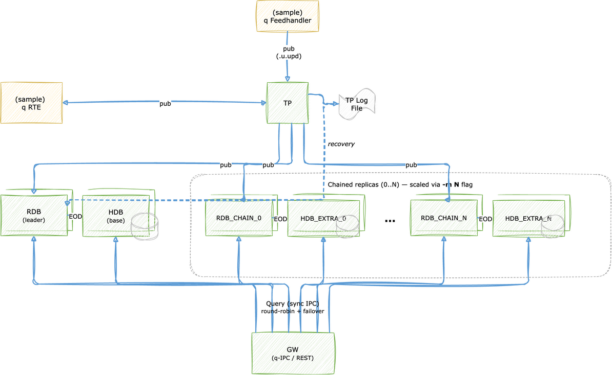

# Scaled Tick++ Reference Architecture

A template for a scalable KDB-X Tick++ architecture with additional layers for custom configuration.

## Description

The architecture contained within this repository consists of the following q processes:

- **Tickerplant (TP)** — receives updates from the feedhandler and distributes them to all subscribers
- **Feedhandler (FH)** — parses structured sample data and publishes to the tickerplant on a timer
- **Realtime Database (RDB)** — the leader, *dedicated to intraday writedown*. Subscribes to the tickerplant, flushes rows older than the cutoff to int-partitions every `FLUSH_INTV_MIN` minutes (dropping them from memory and signalling the IDB), and at EOD merges those int-partitions into the HDB date partition. Does **not** serve `rdb`-tier queries
- **Chained RDB replicas (RDB_CHAIN_i)** — full-data read replicas started with `-m`. They serve all `rdb`-tier queries via the gateway and provide leader failover: if the leader dies, the tickerplant promotes one into the writedown role (its `MAIN_FLAG`-gated flush then begins)
- **Intraday Database (IDB)** — a single process (not replicated) that loads the int-partitions written by the leader and serves the `idb` query tier. Reloads on demand when the leader calls `.idb.reload[]` after each flush
- **Historical Database (HDB)** — stores partitioned on-disk data, reloaded after each end-of-day save. Additional `HDB_EXTRA_i` instances start alongside the chained replicas
- **Real-Time Engine (RTE)** — subscribes to the tickerplant, runs enrichment functions, and publishes derived tables back to the tickerplant
- **Gateway (GW)** — *pure q-IPC* entry point with **deferred-sync** routing (`-30!`). Receives sync requests from q clients and REST_GW(s), assigns each a guid, async-dispatches to the chosen DB replica(s), and resumes the client response from a callback. Stays non-blocking under load so the chained replicas / IDB / HDB can actually serve in parallel. Routes across four tiers: `rdb`, `idb`, `hdb`, and `all` (3-way fan-out)
- **REST Gateway (REST_GW_i)** — thin HTTP front-end loading `kx.rest` and the analytics from `ANALYTIC_DIR`. Endpoint handlers call `.restgw.query` which is a sync IPC call to GW; the GW's deferred-sync mechanic naturally unblocks the REST_GW when the result is ready. N instances share `REST_PORT` via SO_REUSEPORT (`-p rp,$REST_PORT`); on Linux the kernel load-balances HTTP connections across them, scaling HTTP throughput independently of the replica count

This combines the chained-RDB failover model with the intraday writedown path from [tick++](../tick++/README.md) and the canonical kdb+ deferred-sync gateway pattern: the leader does the writedown that feeds the single IDB; the chained replicas remain the query servers; and the GW + REST_GW split keeps the gateway non-blocking while preserving the existing sync `.kxgw.query` API for callers. The documentation below explains where to take schemas, sample data, and analytics from and how to change them, and how to customise the architecture — for example how to deploy more than one chained RDB/HDB pair or scale HTTP front-ends.

### Intraday Writedown Flow

```
                                                ┌──> RDB_CHAIN_0..N ──> (serve `rdb` queries + failover)
TP ──> (sub) ──┬──> RDB (leader) ── flush N min ─┴──> <IDB_DIR>/today/<i>/<table>/
               │                                 │
               │                                 └─ async signal ──> IDB.reload[] ──> (serves `idb` queries)
               │
               └ EOD: leader merges all int-partitions into <HDB_DIR>/<date>/, reloads every HDB
```

The leader (`MAIN_FLAG=1b`) is the only RDB that writes down. Every `FLUSH_INTV_MIN` minutes it writes rows older than `now - FLUSH_INTV_MIN` to a fresh int-partition under `<IDB_DIR>/today/<i>/`, drops them from memory, and signals the IDB to reload. At EOD it flushes any remaining rows as the final int-partition, merges every int-partition into a sorted `p#sym` date partition under `<HDB_DIR>/<date>/`, clears the staging dir, reloads every HDB, and signals the IDB to clear. The next int-partition index is read from the staging dir, so a follower promoted to leader continues the sequence rather than clobbering it.

Because the leader sheds flushed rows it would return inconsistent `rdb` results, so the gateway excludes it from the `rdb` pool. The current leader is identified by polling each RDB's `MAIN_FLAG` on a 2-second timer (not per query — see the gateway section below). At least one chained replica (`-m >= 1`) is therefore required to serve `rdb` queries; use `-m >= 2` for query continuity through a leader failure.

### Deferred-Sync Gateway

The gateway uses a canonical kdb+ "deferred-sync" pattern. A client sends a normal *synchronous* request (``gwh (`.kxgw.query; `rdb; "...")``); the GW immediately defers the response, async-dispatches to a chosen DB, and resumes the client when the DB calls back.

### Architecture Diagram



## Usage

### Prerequisites

The following KDB-X modules are required for full deployment of the system as they are integrated throughout the code - however, these are supplementary and are not prerequisites to the architecture itself:

- [logging](https://github.com/KxSystems/logging)
- [printf](https://github.com/KxSystems/printf)
- [kx.rest](https://code.kx.com/kdb-x/modules/rest-server/overview.html)

### Configuration

The following configuration steps are required before being able to run the tick processes:

- Create a `.env` file within the repo with the following variables defined. An example can be found under `samples/sample_env`.

  | Variable                  | Example Value                                     | Description                                                                                                              |
  | ------------------------- | ------------------------------------------------- | ------------------------------------------------------------------------------------------------------------------------ |
  | SCHEMA_DIR                | /path/to/repo/samples/schemas                     | Directory containing one or more `.q` files with table schemas used by the system.                                       |
  | SAMPLE_DATA               | /path/to/repo/samples/data                        | Directory containing the raw data files ingested by the feedhandler.                                                     |
  | TPLOG_DIR                 | /path/to/repo/app/tplogs                          | Directory to store tickerplant log files.                                                                                |
  | TPLOG_NAME                | tpLog                                             | Prefix for the tickerplant log file name.                                                                                |
  | HDB_DIR                   | /path/to/repo/app/hdb                             | Directory to store on-disk partitioned HDB data.                                                                         |
  | PROCESS_LOG_DIR           | /path/to/repo/app/proclogs                        | Directory to store per-process log files.                                                                                |
  | TICK_PORT                 | 5010                                              | Port for the tickerplant process.                                                                                        |
  | RDB_PORT                  | 5011                                              | Port for the realtime database process.                                                                                  |
  | HDB_PORT                  | 5012                                              | Port for the historical database process.                                                                                |
  | GW_PORT                   | 5013                                              | Port for the gateway process (q-IPC and REST).                                                                           |
  | FH_PORT                   | 5014                                              | Port for the feedhandler process.                                                                                        |
  | IDB_PORT                  | 5015                                              | Port for the single intraday database process.                                                                           |
  | RTE_PORT                  | 5016                                              | Port for the real-time engine process.                                                                                   |
  | REST_PORT                 | 5018                                              | HTTP port served by REST_GW(s). Shared across all REST_GW instances via SO_REUSEPORT (`-p rp,$REST_PORT`).                |
  | FH_TIMER                  | 60000                                             | Feedhandler publish interval in milliseconds.                                                                            |
  | FH_ANALYTIC_DIR           | /path/to/repo/samples/data/fh-analytics           | Directory containing feedhandler parser `.q` files.                                                                      |
  | ANALYTIC_DIR              | /path/to/repo/samples/analytics                   | Directory containing REST endpoint analytics `.q` files loaded by the gateway.                                           |
  | RTE_ENRICH_FILE           | /path/to/repo/samples/enrichments/enrich-sample.q | Path to the enrichment file loaded by the real-time engine.                                                              |
  | IDB_DIR                   | /path/to/repo/app/idb                             | Staging directory for intraday int-partitions (`<IDB_DIR>/today/<i>/`) written by the leader and served by the IDB.       |
  | FLUSH_INTV_MIN            | 5                                                 | Intraday flush interval in minutes — how often the leader writes int-partitions and signals the IDB to reload.           |
  | REQ_TIMEOUT               | 0D00:01:00                                        | Per-request timeout (timespan) in the deferred-sync GW. Expired requests are returned to the client as a tagged signal.   |
  | REST_GW_COUNT             | 1                                                 | Number of REST_GW front-ends to launch. Each shares `REST_PORT` via SO_REUSEPORT; raise on Linux for HTTP concurrency.     |
  | PARALLEL_PORT_RANGE_START | 5020                                              | Starting port for additional RDB/HDB pairs started with `-m`. Pairs use ports `start+2i` (RDB_CHAIN_i) and `start+2i+1` (HDB_EXTRA_i). |

- Create a `.q` file in `SCHEMA_DIR` containing schemas of tables to be used by the system. Multiple schema files can be used.
- Create the `app/tplogs`, `app/hdb`, `app/idb`, and `app/proclogs` directories.
- Ensure scripts under `scripts/` are executable.

#### Directory creation

```bash
cp samples/sample_env .env && \
source .env && \
mkdir -p $TPLOG_DIR $HDB_DIR $IDB_DIR $PROCESS_LOG_DIR
```

### Start

To run the system, execute the startup script from the project root:

```bash
$ ./scaled-tick++/scripts/startup.sh
Starting Scaled Tick++ Reference Architecture...
  .env:             [.env]
  Secondaries:      [0]
  Chained RDBs:     [1]
  Flush interval:   [5 min]
  Req timeout:      [0D00:01:00]
  RDB chain ports:  [5020]
  HDB extra ports:  [5021]
  REST_GWs:         [1]  (shared port rp,5018)

  Started TP        [5010]
  Started IDB       [5015]
  Started RDB       [5011]
  Started RDB_CHAIN_0 [5020]
  Started HDB       [5012]
  Started HDB_EXTRA_0 [5021]
  Started FH        [5014]
  Started RTE       [5016]
  Started GW        [5013]
  Started REST_GW_0 [rp,5018]

Stack started. Logs: app/proclogs/startup.log
```

> The leader `RDB` is dedicated to writedown and does not serve `rdb`-tier queries, so at
> least one chained replica is required — `-m` defaults to `1` and a value below `1` is rejected.
> The GW listens for q-IPC on `GW_PORT=5013`; HTTP/REST clients connect to `REST_PORT=5018`
> served by `REST_GW_0..N` (raise `REST_GW_COUNT` for parallel HTTP throughput on Linux).

This assumes `.env` is in the project root. For a file stored elsewhere use the `-e` flag:

```bash
$ ./scaled-tick++/scripts/startup.sh -e /path/to/.env
```

<details>
<summary>Additional Optional Flags</summary>

- **-s**

  Number of secondary threads to make available for each process.

  Defaults to 0.

  Reference: https://code.kx.com/q/basics/cmdline/#-s-secondary-threads

  ```bash
  $ ./scaled-tick++/scripts/startup.sh -s 4
  ```

- **-m**

  Number of chained RDB replicas (and paired HDB instances) to start. Each `RDB_CHAIN_i` is a full-data read replica that serves `rdb`-tier queries and can be promoted to the writedown leader on failover. The leader RDB (`RDB`) is dedicated to writedown and is **not** in the query pool, so at least one replica is required.

  Defaults to 1 (minimum 1). Use `-m 2` or more for query continuity through a leader failure — when the leader dies one replica is promoted into the writedown role, so a second replica must remain to keep serving `rdb` queries.

  Reference: https://code.kx.com/q/kb/kdb-tick/#chained-rdbs

  ```bash
  $ ./scaled-tick++/scripts/startup.sh -m 2
  ```

</details>

### Stop

To stop the system run the shutdown script from the project root:

```bash
$ ./scaled-tick++/scripts/shutdown.sh
Killing processes:
  TP          [118666]
  IDB         [118667]
  RDB         [118668]
  RDB_CHAIN_0 [118669]
  HDB         [118670]
  HDB_EXTRA_0 [118671]
  FH          [118672]
  RTE         [118673]
  GW          [118674]
  REST_GW_0   [118675]
```

### Data Ingestion

Within the feedhandler, custom parsers are loaded dynamically from the `fh-analytics` directory and executed via the `.fh.upsert` namespace. Each upsert function runs structured data parsing, schema normalisation, and TP publishing.

Live data publishing is driven by the timer interval and initialized automatically when the system starts. The interval can also be overridden at runtime using the `scripts/fh-timer.sh` script.

<details>
<summary>Example .fh.upsert Function Format</summary>

```q
.fh.upsert.funcName:{[]
    // custom logic to publish to TP
    neg[TP]("u.upd"; tabName; records);
}
```

`.fh.upsert` functions must take no arguments and publish to the TP. Parsing and normalisation are handled by separate custom functions stored within the `fh-analytics` directory.

</details>

### Real-Time Enrichment

The RTE subscribes to tickerplant tables, runs user-defined enrichment functions, and publishes the results as new derived tables back to the tickerplant (so they also appear in the RDB). Enrichment functions are registered at startup from the file set by `RTE_ENRICH_FILE`.

<details>
<summary>Example Enrichment File</summary>

```q
// Define the enrichment function (global — name is passed to .rte.addEnrichment)
myEnrichment:{[data]
    derived: update heatIndex:... from data;
    .rte.pub[`derivedTable; derived];
 };

// Register the enrichment function and subscribe to the source table
.rte.addEnrichment[`myEnrichment; `weather]
.rte.addSubscription[`weather; `]
```

</details>

### Restart Individual Processes

All processes write structured logs to `PROCESS_LOG_DIR` in the format `<procName>_<datetime>.log`.

To restart a single named process without taking down the whole stack:

```bash
$ ./scaled-tick++/scripts/restart.sh GW
$ ./scaled-tick++/scripts/restart.sh RTE
$ ./scaled-tick++/scripts/restart.sh RDB_CHAIN_0 -m 1
$ ./scaled-tick++/scripts/restart.sh REST_GW_0
```

To identify running processes:

```bash
$ pgrep -af -- -procName
```

### Failover

The first RDB (`RDB`) is the leader and holds the writedown role (`MAIN_FLAG=1b`): it flushes int-partitions to the IDB and merges them into the HDB at EOD. Each `RDB_CHAIN_i` starts as a follower that serves `rdb`-tier queries. If the leader fails, the tickerplant (`.u.failoverRDB`) promotes the first available follower by flipping its `MAIN_FLAG` over IPC; the promoted follower then begins writing down (its flush is `MAIN_FLAG`-gated and picks up the existing int-partition sequence from the staging dir).

Because the leader sheds flushed rows, the gateway excludes it from the `rdb` query pool. The current leader is identified by polling each RDB's `MAIN_FLAG` on a **2-second timer** (and immediately on any `.z.pc` for an RDB handle) — *not* per query, because synchronous polling inside the deferred-sync path would re-block the GW the moment it dispatched. The promoted follower likewise leaves the query pool, so:

- `-m 1` survives normal operation (1 writedown leader + 1 query replica) but a leader failure leaves no query replica until you start a new one.
- `-m 2` or more keeps `rdb` queries flowing through a leader failure (one replica is promoted, the rest keep serving).

_Note: if the leader RDB fails it should **not** be restarted as `RDB` — a follower has already been promoted, and a second `MAIN_FLAG=1b` process would write down into the same staging dir. Start a new `RDB_CHAIN_<N>` instead to return to the desired replica count._

The gateway connects to all DB processes on startup. Failover-detection window is bounded at 2 s. Reconnection to a restarted DB happens within the same 2 s timer. In-flight requests that were dispatched to a now-dead DB are reaped by the `REQ_TIMEOUT` sweep (default 60 s) — clients receive a `"TIMEOUT: Request timed out"` signal.

### Querying

#### q-IPC

The gateway exposes `.kxgw.query[target; query]` for synchronous queries from q clients:

```q
gwh: hopen `$"::",string GW_PORT

// Query the chained RDB followers (most recent in-memory data, not yet flushed)
gwh (`.kxgw.query; `rdb; "select from energy")

// Query the IDB (today's flushed int-partitions, in memory from disk)
gwh (`.kxgw.query; `idb; "select from energy")

// Query the HDB (historical, post-EOD)
gwh (`.kxgw.query; `hdb; "select from energy where date=.z.d-1")

// Fan out across all three tiers (RDB + IDB + HDB); returns `rdb`idb`hdb!(...)
gwh (`.kxgw.query; `all; "select from energy")
```

Note: the `rdb` tier is served by the chained RDB followers, **not** the writedown leader — the leader sheds flushed rows and never serves queries.

See `samples/analytics/endpoints-examples.q` for further examples.

#### REST

REST endpoints are served by `REST_GW_0..N` on `REST_PORT` (default `5018`) — not by the GW itself. Each REST_GW loads `kx.rest` plus the analytics in `ANALYTIC_DIR`; endpoint handlers call `.restgw.query[target; query]` which is a sync IPC call to the GW. The GW handles deferred sync, the REST_GW's sync call blocks (no busy wait) until the result is ready, kx.rest serialises it to JSON, and the HTTP client gets a normal response.

REST_GWs share `REST_PORT` via SO_REUSEPORT — on Linux, raising `REST_GW_COUNT` scales HTTP throughput because the kernel load-balances incoming connections across the front-ends.

The sample analytics expose the following endpoints:

<details>
<summary>REST API Reference</summary>

### /energy/rdb

Query the energy table on the RDB (realtime data).

| Parameter | Required | Type      | Default                    | Description                  |
|-----------|----------|-----------|----------------------------|------------------------------|
| t1        | No       | Timespan  | 0D00:00:00.000000000       | Lower time bound             |
| t2        | No       | Timespan  | 0D23:59:59.999999999       | Upper time bound             |
| s         | No       | Symbol    | (all)                      | Sym filter (e.g. BLOWER78_1) |

```bash
curl "localhost:${REST_PORT}/energy/rdb"
curl "localhost:${REST_PORT}/energy/rdb?s=BLOWER78_1"
```

### /energy/hdb

Query the energy table on the HDB (historical data).

| Parameter | Required | Type      | Default  | Description           |
|-----------|----------|-----------|----------|-----------------------|
| d         | Yes      | Date      | .z.d-1   | Partition date        |
| t1        | No       | Timespan  | 0D00:... | Lower time bound      |
| t2        | No       | Timespan  | 0D23:... | Upper time bound      |
| s         | No       | Symbol    | (all)    | Sym filter            |

```bash
curl "localhost:${REST_PORT}/energy/hdb?d=2026.05.06"
```

### /energy/meta

Returns the schema of the energy table.

```bash
curl "localhost:${REST_PORT}/energy/meta"
```

### /weather/rdb, /weather/hdb, /weather/meta

Same structure as the energy endpoints, applied to the weather table.

| Parameter | Required | Type      | Default  | Description                       |
|-----------|----------|-----------|----------|-----------------------------------|
| s         | No       | Symbol    | (all)    | Location sym (e.g. `San Diego`)   |

</details>

#### Adding Endpoints

Custom analytics can be added and exposed as REST endpoints by creating `.q` scripts in `ANALYTIC_DIR`. Each script defines handler functions and registers them in the `.endpoints` namespace using `.rest.reg.data`.

<details>
<summary>.endpoints Namespace Format</summary>

```q
.endpoints.newEndpoint:(!). flip (
    (`request; `get);
    (`endpoint; "/endpointPath");
    (`description; "Description of endpoint");
    (`qFunc; qHandlerFunction);
    (
        `params;
        .rest.reg.data[`paramName1; paramType; requiredFlag; defaultVal; "description"],
        .rest.reg.data[`paramNameN; paramType; requiredFlag; defaultVal; "description"]
    )
 );
```

The handler function receives the parameters as positional arguments:

```q
qHandlerFunction:{[paramName1; ...; paramNameN]
    .restgw.query[`rdb; (?; `myTable; ...; 0b; ())]
 };
```

Use `.restgw.query` within analytics handlers — it is aliased to `.kxgw.query` in the GW.

</details>

## Logging

### Usage

Logging is enabled on all processes by loading `utils/logging.q` (via `utils/main.q`). This initializes the `kx.log` module and redirects output to a per-process log file.

Default usage documentation can be found at https://github.com/KxSystems/logging/blob/main/docs/reference.md

<details>
<summary>Custom API Reference</summary>

### .log.procStarted

Logs the q command used to start the current process.

```q
q) .log.procStarted["Tickerplant"];
2026.05.06D09:07:36.465107038 info PID[71505] HOST[hostname] TP started using command: q scaled-tick++/tick.q ...
```

### .log.rollover

Rolls the current process log file to a new date.

```q
q) .log.rollover["TP"; .z.d+1];
```

</details>

### Default Behaviour

- Process logs are saved to `PROCESS_LOG_DIR` in the `.env` file.
- Log file names follow the format `<procName>_<datetime>.log`.
- A `startup.log` file is created by `scripts/startup.sh`.
- All log levels (trace, debug, info, warn, error, fatal) are written to the process log file.

<details>
<summary>Example Process Log Directory</summary>

```bash
$ ls app/proclogs/
FH_20260506T090736457.log
GW_20260506T090736411.log
HDB_20260506T090736461.log
HDB_EXTRA_0_20260506T090736518.log
IDB_20260506T090736459.log
RDB_20260506T090737390.log
RDB_CHAIN_0_20260506T090737435.log
REST_GW_0_20260506T090736600.log
RTE_20260506T090736460.log
TP_20260506T090736465.log
startup.log
```

</details>

### Log level

The default log level is `info`. It can be overridden per-process in two ways:

| Method | Example | Scope |
|--------|---------|-------|
| Env var `LOG_LEVEL` in `.env` | `export LOG_LEVEL=debug` | All processes launched from that shell |
| CLI arg `-logLevel` | `q scaled-tick++/rte.q ... -logLevel debug ...` | One process (takes precedence over env) |

`samples/sample_env` includes `export LOG_LEVEL=info`; change it there to set a different default for the whole stack.

Accepted values: `trace`, `debug`, `info`, `warn`, `error`, `fatal`. Anything else logs a `warn` on startup and the level stays at `info`. When the effective level is not `info`, the process logs `Log level set to [<level>]` as its first info line.

### Log Rotation

The `utils/rotate-logs.sh` script deletes old process log and tickerplant log files to prevent unbounded disk usage. It reads `PROCESS_LOG_DIR` and `TPLOG_DIR` from the `.env` file and accepts optional flags to control retention period.

```bash
# Delete proclogs and tplogs older than 7 days (default)
$ ./scaled-tick++/utils/rotate-logs.sh

# Keep only 3 days of proclogs, 14 days of tplogs
$ ./scaled-tick++/utils/rotate-logs.sh --keep-days 3 --tp-keep-days 14
```

The script preserves `startup.log` regardless of age.

## Timers

Additional logic allows multiple separately-defined functions to be called on a single timer (`.z.ts`) per process. Functions are added to the `.timer.funcs` dictionary, initialized by `utils/timer.q`.

<details>
<summary>Example Timer Function</summary>

```q
.timer.funcs[`newFunction]:{[]
    // custom logic
};
```

</details>

## FH Timer Script

`scripts/fh-timer.sh` must be sourced to expose two functions for dynamic timer control. Both functions open and close an IPC connection inline, allowing interval adjustments at runtime without restarting the FH process.

```bash
source ./scaled-tick++/scripts/fh-timer.sh
start_fh_timer   # enable ingest at $FH_TIMER ms intervals
stop_fh_timer    # pause ingest
```

## Testing

An end-to-end test suite is provided at `tests/e2e-test.q`. It covers data ingestion, q-IPC and REST queries, EOD, failover, and operational scripts. Start the stack with **`-m 2`** before running it — the failover phase kills the leader (promoting one replica into the writedown role) and asserts that `rdb` queries continue via the surviving replica:

```bash
./scaled-tick++/scripts/startup.sh -m 2
source .env && q scaled-tick++/tests/e2e-test.q -gwPort $GW_PORT -restPort $REST_PORT \
    -tpPort $TICK_PORT -fhPort $FH_PORT -procName e2e
```

Results are written to `app/proclogs/e2e_<datetime>.log` in the same structured format as all other process logs.

## Appendix

### Directory Trees

<details>
<summary>Initial Directory Tree</summary>

```
scaled-tick++/
├── README.md
├── scripts/
│   ├── fh-timer.sh
│   ├── restart.sh
│   ├── shutdown.sh
│   └── startup.sh
├── tests/
│   ├── api-test.q
│   ├── e2e-test.q
│   └── rest-test.q
├── src/
│   ├── client.q
│   ├── fh.q
│   ├── gw.q
│   ├── hdb.q
│   ├── idb.q
│   ├── rdb.q
│   ├── restgw.q
│   ├── rte.q
│   ├── tick.q
│   └── u.q
└── utils/
    ├── logging.q
    ├── main.q
    ├── rotate-logs.sh
    └── timer.q
```

</details>

<details>
<summary>Directory Tree Containing Data</summary>

```
app/
├── hdb/
│   ├── 2026.05.06/
│   │   ├── energy/
│   │   │   ├── consumption
│   │   │   ├── date
│   │   │   ├── sym
│   │   │   ├── time
│   │   │   └── timeWindow
│   │   ├── weather/
│   │   │   ├── dateTime
│   │   │   ├── humidity
│   │   │   ├── precipitation
│   │   │   ├── sym
│   │   │   ├── temp
│   │   │   ├── time
│   │   │   └── windSpeed
│   │   └── weatherHeatIndex/
│   │       ├── dateTime
│   │       ├── heatIndex
│   │       ├── sym
│   │       └── time
│   └── sym
├── idb/
│   └── today/              # intraday staging (cleared at EOD)
│       ├── 0/              # int-partition written by the leader's first flush
│       │   ├── energy/
│       │   ├── weather/
│       │   └── weatherHeatIndex/
│       └── 1/              # ...subsequent flushes
│           └── ...
├── proclogs/
│   ├── GW_<datetime>.log
│   ├── IDB_<datetime>.log
│   ├── RDB_<datetime>.log
│   └── ...
└── tplogs/
    └── tpLog<date>
```

</details>

### Schema Files

Schemas must have `time` and `sym` as the first two columns.

<details>
<summary>Example schema file</summary>

```q
energy:([] time:`timespan$(); sym:`symbol$(); date:`date$(); timeWindow:`time$(); consumption:`float$())
weather:([] time:`timespan$(); sym:`symbol$(); dateTime:`datetime$(); temp:`float$(); humidity:`float$(); precipitation:`float$(); windSpeed:`float$())
weatherHeatIndex:([] time:`timespan$(); sym:`symbol$(); dateTime:`datetime$(); heatIndex:`float$())
```

</details>

### Sample Data

The sample data used is a mixture of CSV and PDF files. Custom parsers normalise the sample data to match the TP schema.

<details>
<summary>Sample Data Directory Tree</summary>

```
samples/data/
├── fh-analytics/
│   └── parse-structured-data.q
├── structured/
│   └── *.csv
└── unstructured/
    └── *.pdf
```

</details>

<details>
<summary>Sample Files Reference</summary>

**Structured**

- https://www.kaggle.com/datasets/vitthalmadane/energy-consumption-time-series-dataset/data?select=KwhConsumptionBlower78_1.csv
- https://www.kaggle.com/datasets/prasad22/weather-data

**Unstructured**

- https://www.gov.uk/government/statistics/energy-chapter-1-digest-of-united-kingdom-energy-statistics-dukes

</details>
