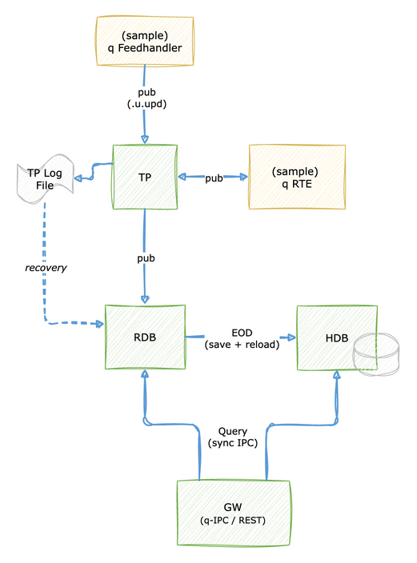

# Tick Reference Architecture

A deployable template for base KDB-X tick architecture.

## Description

The architecture contained within this repository consists of the following q processes:

- **Tickerplant (TP)** — receives updates from the feedhandler and distributes them to all subscribers
- **Feedhandler (FH)** — parses structured sample data and publishes to the tickerplant on a timer
- **Realtime Database (RDB)** — subscribes to the tickerplant and holds today's data in memory; saves to HDB at end of day
- **Historical Database (HDB)** — stores partitioned on-disk data, reloaded after each end-of-day save
- **Real-Time Engine (RTE)** — subscribes to the tickerplant, runs enrichment functions, and publishes derived tables back to the tickerplant
- **Gateway (GW)** — routes queries to the RDB and/or HDB and serves REST endpoints for the analytics defined in `ANALYTIC_DIR`

### Architecture Diagram



## Usage

### Prerequisites

The following KDB-X modules are required for full deployment of the system as they are integrated throughout the code - however, these are supplementary and are not prerequisites to the architecture itself:

- [logging](https://github.com/KxSystems/logging)
- [printf](https://github.com/KxSystems/printf)
- [kx.rest](https://code.kx.com/kdb-x/modules/rest-server/overview.html)

### Configuration

Base tick is designed to run out-of-the-box with no per-deployment setup. All configuration lives in a single shared env file, [`samples/sample_env`](../samples/sample_env), which the `tick/scripts/` and `tick-x/scripts/` scripts source — so a value changed there applies to both stacks. `tick/scripts/startup.sh` auto-creates the runtime directories on first run. To customize without editing the committed defaults, copy the file and pass it with `-e` (e.g. `./tick/scripts/startup.sh -e .env`).

The defaults listed below are defined in [`samples/sample_env`](../samples/sample_env) (tick-x-only settings such as `IDB_DIR` and `CHAINED_RDB_PORT` are present there too but ignored by the base tick scripts):

  | Variable        | Default Value                              | Description                                                                          |
  | --------------- | ------------------------------------------ | ------------------------------------------------------------------------------------ |
  | ROOT_DIR        | _project root_ (`$(pwd)` at launch)        | Base directory every other path is derived from. The scripts run from the project root, so the defaults below resolve to absolute paths under it. |
  | SCHEMA_DIR      | $ROOT_DIR/samples/schemas                  | Directory containing one or more `.q` files with table schemas used by the system.   |
  | SAMPLE_DATA     | $ROOT_DIR/samples/data                     | Directory the sample feedhandler reads tick data from (consumed by the feed via `getenv`). |
  | TPLOG_DIR       | $ROOT_DIR/app/tplogs                       | Directory to store tickerplant log files (auto-created).                             |
  | TPLOG_NAME      | tpLog                                      | Prefix for the tickerplant log file name.                                            |
  | HDB_DIR         | $ROOT_DIR/app/hdb                          | Directory to store on-disk partitioned HDB data (auto-created).                      |
  | PROCESS_LOG_DIR | $ROOT_DIR/app/proclogs                     | Directory to store per-process log files (auto-created).                             |
  | LOG_LEVEL       | info                                       | Default log level. Accepted: `trace`, `debug`, `info`, `warn`, `error`, `fatal`.     |
  | TICK_PORT       | 5010                                       | Port for the tickerplant process.                                                    |
  | RDB_PORT        | 5011                                       | Port for the realtime database process.                                              |
  | HDB_PORT        | 5012                                       | Port for the historical database process.                                            |
  | GW_PORT         | 5013                                       | Port for the gateway process (q-IPC and REST).                                       |
  | FH_PORT         | 5014                                       | Port for the feedhandler process.                                                    |
  | RTE_PORT        | 5016                                       | Port for the real-time engine process.                                               |
  | FH_TIMER        | 60000                                      | Feedhandler publish interval in milliseconds.                                        |
  | ANALYTIC_DIR    | $ROOT_DIR/samples/analytics                | Directory containing REST endpoint analytics `.q` files loaded by the gateway.       |
  | FH_ANALYTIC_DIR | $ROOT_DIR/samples/data/fh-analytics        | _Optional._ Directory of custom feedhandler parse `.q` files. Not loaded by the scripts by default — a convenience pointer for custom feed-parsing setups. |
  | RTE_ENRICH_FILE | $ROOT_DIR/samples/enrichments/enrich-sample.q | _Optional._ Path to an RTE enrichment `.q` file. Not loaded by default; pass it to the RTE via the `-enrichFile` CLI arg (see [Real-Time Enrichment](#real-time-enrichment)). |

### Start

To run the system, execute the startup script from the project root:

```bash
$ ./tick/scripts/startup.sh
Starting Tick Reference Architecture...
  Secondaries:      [0]

  Started TP        [5010]
  Started RDB       [5011]
  Started HDB       [5012]
  Started FH        [5014]
  Started RTE       [5016]
  Started GW        [5013]

Stack started. Logs: app/proclogs/startup.log
```

<details>
<summary>Additional Optional Flags</summary>

- **-s**

  Number of secondary threads to make available for each process.

  Defaults to 0.

  Reference: https://code.kx.com/q/basics/cmdline/#-s-secondary-threads

  ```bash
  $ ./tick/scripts/startup.sh -s 4
  ```

</details>

### Stop

To stop the system run the shutdown script from the project root:

```bash
$ ./tick/scripts/shutdown.sh
Killing processes:
  TP     [118666]
  RDB    [118667]
  HDB    [118668]
  FH     [118669]
  RTE    [118670]
  GW     [118671]
```

### Data Ingestion

The feedhandler publishes one synthetic row each to the `energy` and `weather` tables on every timer tick. The publishing logic is a pair of direct ``neg[TP_H] (`.u.upd; <table>; <row data>)`` calls inside ``.timer.funcs[`fhUpsert]`` in `tick/src/fh.q` — there is no parser dispatcher or analytics directory to load from. Customise by replacing the row construction with your own data source / transformation.

The interval is set by `FH_TIMER` and can be overridden at runtime using the `scripts/fh-timer.sh` script.

### Real-Time Enrichment

The RTE process starts with **no enrichments registered**. It exposes a small registration API so users can plug in their own:

- ``.rte.addEnrichment[`func; `sourceTable]`` — register a global function `func` to run when `sourceTable` publishes.
- ``.rte.addSubscription[`sourceTable; `]`` — subscribe RTE to `sourceTable` on the TP (use `` ` `` for all syms).
- ``.rte.pub[`derivedTable; rows]`` — call from inside your enrichment function to publish derived rows back to the TP.

Two ways to insert custom enrichment:

1. **At startup via `-enrichFile`** — write a `.q` file that defines + registers your enrichment (see the example below), then add `-enrichFile path/to/your-file.q` to the `rte.q` launch in `tick/scripts/startup.sh`.
2. **At runtime via IPC** — open a handle to RTE and call the registration helpers directly ``h(`.rte.addEnrichment; `myEnrich; `weather)``.

<details>
<summary>Example Enrichment File</summary>

```q
// Define the enrichment function (global — name is passed to .rte.addEnrichment)
myEnrichment:{[data]
    derived: update heatIndex:... from data;
    .rte.pub[`derivedTable; derived];
 };

// Register the enrichment function and subscribe to the source table
.rte.addEnrichment[`myEnrichment; `weather]
.rte.addSubscription[`weather; `]
```

</details>

### Restart Individual Processes

All processes write structured logs to `PROCESS_LOG_DIR` in the format `<procName>_<datetime>.log`.

To restart a single named process without taking down the whole stack:

```bash
$ ./tick/scripts/restart.sh GW
$ ./tick/scripts/restart.sh RTE
```

To identify running processes:

```bash
$ pgrep -af -- -procName
```

The gateway connects to the RDB and HDB on startup. If a process is restarted while the gateway is running, the gateway will reconnect automatically on its next timer tick (every 60 seconds).

### Querying

#### q-IPC

The gateway exposes `.kxgw.query[target; query]` for synchronous queries from q clients:

```q
gwh: hopen 5013

// Query the RDB
gwh (`.kxgw.query; `rdb; "select from energy")

// Query the HDB
gwh (`.kxgw.query; `hdb; "select from energy where date=.z.d-1")

// Query both (returns dict with `rdb`hdb keys)
gwh (`.kxgw.query; `both; "select from energy")
```

See `samples/endpoints-examples.q` for further examples.

#### REST

The gateway also serves REST endpoints defined by the analytics files in `ANALYTIC_DIR`. The sample analytics expose the following endpoints:

<details>
<summary>REST API Reference</summary>

### /energy/rdb

Query the energy table on the RDB (realtime data).

| Parameter | Required | Type      | Default                    | Description                  |
|-----------|----------|-----------|----------------------------|------------------------------|
| t1        | No       | Timespan  | 0D00:00:00.000000000       | Lower time bound             |
| t2        | No       | Timespan  | 0D23:59:59.999999999       | Upper time bound             |
| s         | No       | Symbol    | (all)                      | Sym filter (e.g. BLOWER78_1) |

```bash
curl "localhost:${GW_PORT}/energy/rdb"
curl "localhost:${GW_PORT}/energy/rdb?s=BLOWER78_1"
```

### /energy/hdb

Query the energy table on the HDB (historical data).

| Parameter | Required | Type      | Default  | Description           |
|-----------|----------|-----------|----------|-----------------------|
| d         | Yes      | Date      | .z.d-1   | Partition date        |
| t1        | No       | Timespan  | 0D00:... | Lower time bound      |
| t2        | No       | Timespan  | 0D23:... | Upper time bound      |
| s         | No       | Symbol    | (all)    | Sym filter            |

```bash
curl "localhost:${GW_PORT}/energy/hdb?d=2026.05.06"
```

### /energy/meta

Returns the schema of the energy table.

```bash
curl "localhost:${GW_PORT}/energy/meta"
```

### /weather/rdb, /weather/hdb, /weather/meta

Same structure as the energy endpoints, applied to the weather table.

| Parameter | Required | Type      | Default  | Description                       |
|-----------|----------|-----------|----------|-----------------------------------|
| s         | No       | Symbol    | (all)    | Location sym (e.g. `SanDiego`)    |

</details>

#### Adding Endpoints

Custom analytics can be added and exposed as REST endpoints by creating `.q` scripts in `ANALYTIC_DIR`. Each script defines handler functions and registers them in the `.endpoints` namespace using `.rest.reg.data`.

<details>
<summary>.endpoints Namespace Format</summary>

```q
.endpoints.newEndpoint:(!). flip (
    (`request; `get);
    (`endpoint; "/endpointPath");
    (`description; "Description of endpoint");
    (`qFunc; qHandlerFunction);
    (
        `params;
        .rest.reg.data[`paramName1; paramType; requiredFlag; defaultVal; "description"],
        .rest.reg.data[`paramNameN; paramType; requiredFlag; defaultVal; "description"]
    )
 );
```

The handler function receives the parameters as positional arguments:

```q
qHandlerFunction:{[paramName1; ...; paramNameN]
    .restgw.query[`rdb; (?; `myTable; ...; 0b; ())]
 };
```

Use `.restgw.query` within analytics handlers — it is aliased to `.kxgw.query` in the GW.

</details>

## Logging

### Usage

Logging is enabled on all processes by loading `utils/logging.q` (via `utils/main.q`). This initializes the `kx.log` module and redirects output to a per-process log file.

Default usage documentation can be found at https://github.com/KxSystems/logging/blob/main/docs/reference.md

<details>
<summary>Custom API Reference</summary>

### .log.procStarted

Logs the q command used to start the current process.

```q
q) .log.procStarted["Tickerplant"];
2026.05.06D09:07:36.465107038 info PID[71505] HOST[hostname] TP started using command: q tick/src/tick.q ...
```

### .log.rollover

Rolls the current process log file to a new date.

```q
q) .log.rollover["TP"; .z.d+1];
```

</details>

### Default Behaviour

- Process logs are saved to `PROCESS_LOG_DIR` (default `app/proclogs/`).
- Log file names follow the format `<procName>_<datetime>.log`.
- A `startup.log` file is created by `scripts/startup.sh`.
- All log levels (trace, debug, info, warn, error, fatal) are written to the process log file.

<details>
<summary>Example Process Log Directory</summary>

```bash
$ ls app/proclogs/
FH_20260506T090736457.log
GW_20260506T090736411.log
HDB_20260506T090736461.log
RDB_20260506T090737390.log
RTE_20260506T090736460.log
TP_20260506T090736465.log
startup.log
```

</details>

### Log level

The default log level is `info` (set as `LOG_LEVEL` in the shared [`samples/sample_env`](../samples/sample_env), which is exported so q reads it via `getenv`). It can be overridden per-process in two ways:

| Method | Example | Scope |
|--------|---------|-------|
| Edit `LOG_LEVEL` in `samples/sample_env` | `LOG_LEVEL="debug"` | All processes launched by the script |
| CLI arg `-logLevel` | `q tick/src/rte.q ... -logLevel debug ...` | One process (takes precedence over env) |

Accepted values: `trace`, `debug`, `info`, `warn`, `error`, `fatal`. Anything else logs a `warn` on startup and the level stays at `info`. When the effective level is not `info`, the process logs `Log level set to [<level>]` as its first info line.

## Timers

Additional logic allows multiple separately-defined functions to be called on a single timer (`.z.ts`) per process. Functions are added to the `.timer.funcs` dictionary, initialized by `utils/timer.q`.

<details>
<summary>Example Timer Function</summary>

```q
.timer.funcs[`newFunction]:{[]
    // custom logic
};
```

</details>

## FH Timer Script

`scripts/fh-timer.sh` must be sourced to expose two functions for dynamic timer control. Both functions open and close an IPC connection inline, allowing interval adjustments at runtime without restarting the FH process.

```bash
source ./tick/scripts/fh-timer.sh
start_fh_timer   # enable ingest at $FH_TIMER ms intervals
stop_fh_timer    # pause ingest
```

## Testing

An end-to-end test suite is provided at `tests/e2e-test.q`. It covers data ingestion, q-IPC and REST queries, EOD, and operational scripts. Run it from the project root after starting the stack:

```bash
q tick/tests/e2e-test.q -gwPort 5013 -tpPort 5010 -fhPort 5014 -procName e2e
```

Logging defaults to `app/proclogs`, so results are written to `app/proclogs/e2e_<datetime>.log` in the same structured format as all other process logs.

## Appendix

### Directory Trees

<details>
<summary>Initial Directory Tree</summary>

```
tick/
├── README.md
├── scripts/
│   ├── fh-timer.sh
│   ├── restart.sh
│   ├── shutdown.sh
│   └── startup.sh
├── src/
│   ├── client.q
│   ├── fh.q
│   ├── gw.q
│   ├── hdb.q
│   ├── rdb.q
│   ├── rte.q
│   ├── tick.q
│   └── u.q
├── tests/
│   ├── api-test.q
│   ├── e2e-test.q
│   └── rest-test.q
└── utils/
    ├── logging.q
    ├── main.q
    └── timer.q
```

</details>

<details>
<summary>Directory Tree Containing Data</summary>

```
app/
├── hdb/
│   ├── 2026.05.06/
│   │   ├── energy/
│   │   │   ├── consumption
│   │   │   ├── date
│   │   │   ├── sym
│   │   │   ├── time
│   │   │   └── timeWindow
│   │   ├── weather/
│   │   │   ├── dateTime
│   │   │   ├── humidity
│   │   │   ├── precipitation
│   │   │   ├── sym
│   │   │   ├── temp
│   │   │   ├── time
│   │   │   └── windSpeed
│   │   └── weatherHeatIndex/
│   │       ├── dateTime
│   │       ├── heatIndex
│   │       ├── sym
│   │       └── time
│   └── sym
├── proclogs/
│   ├── GW_<datetime>.log
│   ├── RDB_<datetime>.log
│   └── ...
└── tplogs/
    └── tpLog<date>
```

</details>

### Schema Files

Schemas must have `time` and `sym` as the first two columns.

<details>
<summary>Example schema file</summary>

```q
energy:([] time:`timespan$(); sym:`symbol$(); date:`date$(); timeWindow:`time$(); consumption:`float$())
weather:([] time:`timespan$(); sym:`symbol$(); dateTime:`datetime$(); temp:`float$(); humidity:`float$(); precipitation:`float$(); windSpeed:`float$())
weatherHeatIndex:([] time:`timespan$(); sym:`symbol$(); dateTime:`datetime$(); heatIndex:`float$())
```

</details>

### Sample Data

The sample data used is a mixture of CSV and PDF files. Custom parsers normalise the sample data to match the TP schema.

<details>
<summary>Sample Data Directory Tree</summary>

```
samples/data/
├── fh-analytics/
│   └── parse-structured-data.q
├── structured/
│   └── *.csv
└── unstructured/
    └── *.pdf
```

</details>

<details>
<summary>Sample Files Reference</summary>

**Structured**

- https://www.kaggle.com/datasets/vitthalmadane/energy-consumption-time-series-dataset/data?select=KwhConsumptionBlower78_1.csv
- https://www.kaggle.com/datasets/prasad22/weather-data

**Unstructured**

- https://www.gov.uk/government/statistics/energy-chapter-1-digest-of-united-kingdom-energy-statistics-dukes

</details>
